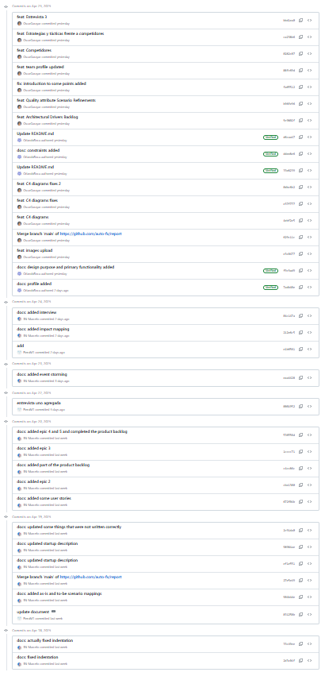
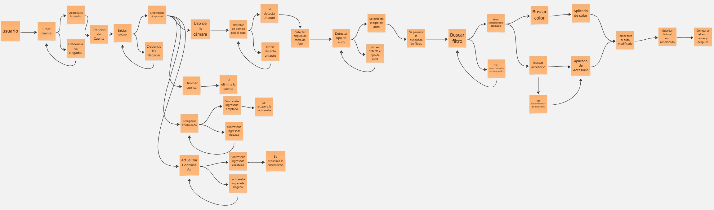

  

  <h1>Universidad Peruana de Ciencias Aplicadas</h1>
  
<strong>Carrera:</strong> Ingeniería de Software

  
<strong>Ciclo:</strong> 2025 - 10

  
<strong>Curso:</strong> Arquitecturas De Software Emergentes (1ASI0728)

  
<strong>Sección:</strong> 2510

  
<strong>Profesor:</strong> Christian Luis De Los Rios Fernandez

  
<strong>Informe de TB1</strong>

  
<strong>Startup:</strong> AfterEffects

  
<strong>Producto:</strong> AutoFX

<table align="center">
  <tr>
    <th>Integrantes</th>
    <th>Código</th>
  </tr>
  <tr>
    <td>Garayar Mori, Oscar Nathaniel</td>
    <td>U202014115</td>
  </tr>
  <tr>
    <td>Mendoza Pimentel, Piero</td>
    <td>U201923446</td>
  </tr>
  <tr>
    <td>Neyra Santa Cruz, Marcelo Sebastian</td>
    <td>U202217241</td>
  </tr>
  <tr>
    <td>Roca Huapaya, Orlando Arturo</td>
    <td>U201919742</td>
  </tr>
</table>

<b>Abril 2025</b>

# Registro de versiones

<table>
  <thead>
    <tr>
        <th>Versión</th>
        <th>Fecha</th>
        <th>Autor</th>
        <th>Descripción de modificación</th>
    </tr>
  </thead>
  <tbody>
  <tr>
      <th>TB1</th>
      <td>08/04/2025</td>
      <td rowspan="3">
        <ul>
          <li>Garayar Mori, Oscar Nathaniel</li>
          <li>Mendoza Pimentel, Piero</li>
          <li>Neyra Santa Cruz, Marcelo Sebastian</li>
          <li>Roca Huapaya, Orlando Arturo</li>
        </ul>
      </td>
      <td>
        Se han agregado los siguientes capítulos
        <ul>
          <li>Capítulo 1</li>
          <li>Capítulo 2</li>
          <li>Capítulo 3</li>
          <li>Capítulo 4</li>
        </ul>
      </td>
  </tr>
  <tr>
    <th>Trabajo Parcial</th>
    <td>16/05/2025</td>
    <td>
      Se han agregado los siguientes capítulos
        <ul>
          <li>Capítulo 5</li>
          <li>Capítulo 6</li>
        </ul>
      </td>
    </td>
  </tr>
  <tr>
    <th>TB2</th>
    <td>03/06/2025</td>
    <td>
      Se han agregado los siguientes capítulos
        <ul>
          <li>Capítulo 6</li>
          <li>Capítulo 7</li>
        </ul>
      </td>
    </td>
  </tr>
  </tbody>
</table>

# Project Report Collaboration Insights

<table>
  <tr>
    <th colspan="2">Entrega TB1</th>
  </tr>
  <tr>
    <td>
      
 Para la entrega TB1 se realizaron los 4 primeros capítulos del informe. A cada integrante se le asignó una parte específica a desarrollar y el informe completo se realizó con éxito.

      
 El informe se realizó en el siguiente repositorio:

      
Reporte: <a href="https://github.com/auto-fx/report">Documento TB1</a>

    </td>
    <td>
      
      
    </td>
  </tr>
  <tr>
    <th colspan="2">Entrega Trabajo Parcial</th>
  </tr>
  <td>
      
 Para la entrega del Trabajo Parcial, se realizaron los capítulos 5 y 6, que incluyen los prototipos de las aplicaciones Landing Page y Móvil

      
 El informe se realizó en el siguiente repositorio:

      
Reporte: <a href="https://github.com/auto-fx/report">Documento Trabajo Parcial</a>

    </td>
    <td>
      
      
    </td>
  <tr>
    <th colspan="2">Entrega TB2</th>
  </tr>
  <td>
      
 Para la entrega de la TB2, se completó el capítulo 6 y se agregó el capítulo 7. Respecto a las aplicaciones, se desarrolló la landing page, se implementó el algoritmo de identificación de autos utilizando Machine Learning, se desarrolló el algoritmo de aplicación de filtros utilizando Unity Ar Fundation y se desarrolló la primera versión de la aplicación mobile

      
El presente trabajo se realizó en los siguientes repositorios:

      
Reporte: <a href="https://github.com/auto-fx/report">Documento TB2</a>

      
Landing Page: <a href="https://github.com/auto-fx/landing-page">Landing Page</a>

      
Aplicación Frontend: <a href="https://github.com/auto-fx/frontend">Frontend</a>

      
Aplicación backend: <a href="https://github.com/auto-fx/backend">Backend</a>

      
Modelo de entrenamiento: <a href="https://github.com/auto-fx/ModelTrainingAutoFix">Algoritmo de Machine Learning</a>

      
Pruebas provisionales: <a href="https://github.com/auto-fx/AutoFXPrototype">Prueba del funcionamiento de detección de autos</a>

    </td>
    <td>
      
      
    </td>
</table>

# Tabla de Contenidos

### [Registro de Versiones](#registro-de-versiones)  
### [Student Outcome](#student-outcome)  
### [Capítulo I: Introducción](#capítulo-i-introducción)  
- [1.1. Startup Profile](#11-startup-profile)  
  - [1.1.1. Descripción de la Startup](#111-descripción-de-la-startup)  
  - [1.1.2. Perfiles de integrantes del equipo](#112-perfiles-de-integrantes-del-equipo)  
- [1.2. Solution Profile](#12-solution-profile)  
  - [1.2.1. Antecedentes y problemática](#121-antecedentes-y-problemática)  
  - [1.2.2. Lean UX Process](#122-lean-ux-process)  
    - [1.2.2.1. Lean UX Problem Statements](#1221-lean-ux-problem-statements)  
    - [1.2.2.2. Lean UX Assumptions](#1222-lean-ux-assumptions)  
    - [1.2.2.3. Lean UX Hypothesis Statements](#1223-lean-ux-hypothesis-statements)  
    - [1.2.2.4. Lean UX Canvas](#1224-lean-ux-canvas)  
- [1.3. Segmentos objetivo](#13-segmentos-objetivo)  

### [Capítulo II: Requirements Elicitation & Analysis](#capítulo-ii-requirements-elicitation--analysis)  
- [2.1. Competidores](#21-competidores)  
  - [2.1.1. Análisis competitivo](#211-análisis-competitivo)  
  - [2.1.2. Estrategias y tácticas frente a competidores](#212-estrategias-y-tácticas-frente-a-competidores)  
- [2.2. Entrevistas](#22-entrevistas)  
  - [2.2.1. Diseño de entrevistas](#221-diseño-de-entrevistas)  
  - [2.2.2. Registro de entrevistas](#222-registro-de-entrevistas)  
  - [2.2.3. Análisis de entrevistas](#223-análisis-de-entrevistas)  
- [2.3. Needfinding](#23-needfinding)  
  - [2.3.1. User Personas](#231-user-personas)  
  - [2.3.2. User Task Matrix](#232-user-task-matrix)  
  - [2.3.3. User Journey Mapping](#233-user-journey-mapping)  
  - [2.3.4. Empathy Mapping](#234-empathy-mapping)  
  - [2.3.5. As-is Scenario Mapping](#235-as-is-scenario-mapping)  
- [2.4. Ubiquitous Language](#24-ubiquitous-language)  

### [Capítulo III: Requirements Specification](#capítulo-iii-requirements-specification)  
- [3.1. To-Be Scenario Mapping](#31-to-be-scenario-mapping)  
- [3.2. User Stories](#32-user-stories)  
- [3.3. Impact Mapping](#33-impact-mapping)  
- [3.4. Product Backlog](#34-product-backlog)  

### [Capítulo IV: Strategic-Level Software Design](#capítulo-iv-strategic-level-software-design)  
- [4.1. Strategic-Level Attribute-Driven Design](#41-strategic-level-attribute-driven-design)  
  - [4.1.1. Design Purpose](#411-design-purpose)  
  - [4.1.2. Attribute-Driven Design Inputs](#412-attribute-driven-design-inputs)  
    - [4.1.2.1. Primary Functionality](#4121-primary-functionality)  
    - [4.1.2.2. Quality Attribute Scenarios](#4122-quality-attribute-scenarios)  
    - [4.1.2.3. Constraints](#4123-constraints)  
  - [4.1.3. Architectural Drivers Backlog](#413-architectural-drivers-backlog)  
  - [4.1.4. Architectural Design Decisions](#414-architectural-design-decisions)  
  - [4.1.5. Quality Attribute Scenario Refinements](#415-quality-attribute-scenario-refinements)  
- [4.2. Strategic-Level Domain-Driven Design](#42-strategic-level-domain-driven-design)  
  - [4.2.1. EventStorming](#421-eventstorming)  
  - [4.2.2. Candidate Context Discovery](#422-candidate-context-discovery)  
  - [4.2.3. Domain Message Flows Modeling](#423-domain-message-flows-modeling)  
  - [4.2.4. Bounded Context Canvases](#424-bounded-context-canvases)  
  - [4.2.5. Context Mapping](#425-context-mapping)  
- [4.3. Software Architecture](#43-software-architecture)  
  - [4.3.1. System Landscape Diagram](#431-system-landscape-diagram)  
  - [4.3.2. Context Level Diagrams](#432-context-level-diagrams)  
  - [4.3.3. Container Level Diagrams](#433-container-level-diagrams)  
  - [4.3.4. Deployment Diagrams](#434-deployment-diagrams)  

### [Capítulo V: Tactical-Level Software Design](#capítulo-v-tactical-level-software-design)  
- [5.X. Bounded Context: <Bounded Context Name>](#5x-bounded-context-bounded-context-name)  
  - [5.X.1. Domain Layer](#5x1-domain-layer)  
  - [5.X.2. Interface Layer](#5x2-interface-layer)  
  - [5.X.3. Application Layer](#5x3-application-layer)  
  - [5.X.4. Infrastructure Layer](#5x4-infrastructure-layer)  
  - [5.X.5. Component Level Diagrams](#5x5-component-level-diagrams)  
  - [5.X.6. Code Level Diagrams](#5x6-code-level-diagrams)  
    - [5.X.6.1. Domain Layer Class Diagrams](#5x61-domain-layer-class-diagrams)  
    - [5.X.6.2. Database Design Diagram](#5x62-database-design-diagram)  

### [Capítulo VI: Solution UX Design](#capítulo-vi-solution-ux-design)  
- [6.1. Style Guidelines](#61-style-guidelines)  
  - [6.1.1. General Style Guidelines](#611-general-style-guidelines)  
  - [6.1.2. Web, Mobile & Devices Style Guidelines](#612-web-mobile--devices-style-guidelines)  
- [6.2. Information Architecture](#62-information-architecture)  
  - [6.2.1. Organization Systems](#621-organization-systems)  
  - [6.2.2. Labeling Systems](#622-labeling-systems)  
  - [6.2.3. Searching Systems](#623-searching-systems)  
  - [6.2.4. SEO Tags and Meta Tags](#624-seo-tags-and-meta-tags)  
  - [6.2.5. Navigation Systems](#625-navigation-systems)  
- [6.3. Landing Page UI Design](#63-landing-page-ui-design)  
  - [6.3.1. Landing Page Wireframe](#631-landing-page-wireframe)  
  - [6.3.2. Landing Page Mock-up](#632-landing-page-mock-up)  
- [6.4. Applications UX/UI Design](#64-applications-uxui-design)  
  - [6.4.1. Applications Wireframes](#641-applications-wireframes)  
  - [6.4.2. Applications Wireflow Diagrams](#642-applications-wireflow-diagrams)  
  - [6.4.3. Applications Mock-ups](#643-applications-mock-ups)  
  - [6.4.4. Applications User Flow Diagrams](#644-applications-user-flow-diagrams)  
- [6.5. Applications Prototyping](#65-applications-prototyping)  

### [Capítulo VII: Product Implementation, Validation & Deployment](#capítulo-vii-product-implementation-validation--deployment)  
- [7.1. Software Configuration Management](#71-software-configuration-management)  
  - [7.1.1. Development Environment Configuration](#711-development-environment-configuration)  
  - [7.1.2. Source Code Management](#712-source-code-management)  
  - [7.1.3. Style Guide & Conventions](#713-style-guide--conventions)  
  - [7.1.4. Deployment Configuration](#714-deployment-configuration)  
- [7.2. Implementation](#72-implementation)  
  - [7.2.X. Sprint n](#72x-sprint-n)  
    - [7.2.X.1. Sprint Planning n](#72x1-sprint-planning-n)  
    - [7.2.X.2. Aspect Leaders and Collaborators](#72x2-aspect-leaders-and-collaborators)  
    - [7.2.X.3. Sprint Backlog n](#72x3-sprint-backlog-n)  
    - [7.2.X.4. Development Evidence](#72x4-development-evidence)  
    - [7.2.X.5. Testing Suite Evidence](#72x5-testing-suite-evidence)  
    - [7.2.X.6. Execution Evidence](#72x6-execution-evidence)  
    - [7.2.X.7. Services Documentation](#72x7-services-documentation)  
    - [7.2.X.8. Deployment Evidence](#72x8-deployment-evidence)  
    - [7.2.X.9. Collaboration Insights](#72x9-collaboration-insights)  
- [7.3. Validation Interviews](#73-validation-interviews)  
  - [7.3.1. Diseño de Entrevistas](#731-diseño-de-entrevistas)  
  - [7.3.2. Registro de Entrevistas](#732-registro-de-entrevistas)  
  - [7.3.3. Evaluaciones según heurísticas](#733-evaluaciones-según-heurísticas)  
- [7.4. Video About-the-Product](#74-video-about-the-product)  

### [Capítulo VIII: Conclusiones y Recomendaciones](#capítulo-viii-conclusiones-y-recomendaciones)  
### [Capítulo IX: Video About-the-Team](#capítulo-ix-video-about-the-team)  
### [Capítulo X: Bibliografía](#capítulo-x-bibliografía)  
### [Capítulo XI: Anexos](#capítulo-xi-anexos)  

# Student Outcome
> **ABET – EAC - Student Outcome 3:** Capacidad de comunicarse efectivamente con un rango de audiencias

<table>
  <thead>
    <tr>
      <th><strong>Criterio específico</strong></th>
      <th><strong>Acciones realizadas</strong></th>
      <th><strong>Conclusiones</strong></th>
    </tr>
  </thead>
  <tbody>
    <tr>
      <td>Comunica oralmente sus ideas y/o resultados con objetividad a público de diferentes especialidades y niveles jerarquicos, en el marco del desarrollo de un proyecto en ingeniería.</td>
      <td>
        <h4>TB1</h4>
        <h5>Garayar Mori, Oscar Nathaniel</h5>
        
Desarrollé entrevistas para la validación inicial del proyecto

        <h5>Mendoza Pimentel, Piero</h5>
        
Desarrollé entrevistas para la validación inicial del proyecto

        <h5>Neyra Santa Cruz, Marcelo Sebastian</h5>
        
Desarrollé entrevistas para la validación inicial del proyecto

        <h5>Roca Huapaya, Orlando Arturo</h5>
        
Desarrollé entrevistas para la validación inicial del proyecto

        <h4>Trabajo Parcial</h4>
        <h5>Garayar Mori, Oscar Nathaniel</h5>
        
Realicé la presentación oral del trabajo parcial

        <h5>Mendoza Pimentel, Piero</h5>
        
Realicé la presentación oral del trabajo parcial

        <h5>Neyra Santa Cruz, Marcelo Sebastian</h5>
        
Realicé la presentación oral del trabajo parcial

        <h5>Roca Huapaya, Orlando Arturo</h5>
        
Realicé la presentación oral del trabajo parcial

        <h4>TB2</h4>
        <h5>Garayar Mori, Oscar Nathaniel</h5>
        
Desarrollé entrevistas para la validación final del proyecto

        <h5>Mendoza Pimentel, Piero</h5>
        
Desarrollé entrevistas para la validación final del proyecto

        <h5>Neyra Santa Cruz, Marcelo Sebastian</h5>
        
Desarrollé entrevistas para la validación final del proyecto

        <h5>Roca Huapaya, Orlando Arturo</h5>
        
Desarrollé entrevistas para la validación final del proyecto

      </td>
      <td>
        <h4>TB1</h4>
        
Para esta primera entrega, se realizó una investigación detallada para poder cumplir con las expectativas del público. Para ello, se realizaron algunas entrevistas para validar la definición y pronto desarrollo del producto AutoFX

        <h4>Trabajo Parcial</h4>
        
Para la entrega del trabajo parcial, se realizó una investigación detallada para poder cumplir las expectativas del público. Debido a ello, se investigó acerca de la correcta manera de definir los bounded context, los application wireframes y application mockups

        <h4>TB2</h4>
        
Para la entrega de la TB2, se realizó una extensa investigación sobre las diferentes tecnologías que se podían utilizar para el desarrollo de nuestra solución y para poder cumplir conlas expectativas del público

      </td>
    </tr>
    <tr>
      <td>Comunica en forma escrita ideas y/o resultados con objetividad a público de diferentes especialidades y niveles jerarquicos, en el marco del desarrollo de un proyecto en ingeniería.</td>
      <td>
        <h4>TB1</h4>
        <h5>Garayar Mori, Oscar Nathaniel</h5>
        
Desarrollé la sección de competidores, architectual drivers backlog y los diagramas C4

        <h5>Mendoza Pimentel, Piero</h5>
        
Desarrollé el startup profile, needfinding y strategic-level domain driven design

        <h5>Neyra Santa Cruz, Marcelo Sebastian</h5>
        
Desarrollé el solution profile, ubiquitous language y todas las secciones del capítulo 3

        <h5>Roca Huapaya, Orlando Arturo</h5>
        
Desarrollé el lean ux, stratefic-level attribute-driven design y el diseño de las entrevistas

        <h4>Trabajo Parcial</h4>
        <h5>Garayar Mori, Oscar Nathaniel</h5>
        
Desarrollé los Style Guidelines y los Mobile Style Guidelines

        <h5>Mendoza Pimentel, Piero</h5>
        
Desarrollé la definición y ejecución del Security Bounded Context

        <h5>Neyra Santa Cruz, Marcelo Sebastian</h5>
        
Desarrollé la definición y ejecución del Filter Bounded Context

        <h5>Roca Huapaya, Orlando Arturo</h5>
        
Desarrollé el Information Arquitecture y Landing Page Style Guidelines y Mockups

        <h4>TB2</h4>
        <h5>Garayar Mori, Oscar Nathaniel</h5>
        
Desarrollé el Sprint 1, los Mobile Mockups, el frontend móvil y el algoritmo de aplicación de filtros

        <h5>Mendoza Pimentel, Piero</h5>
        
Desarrollé el Sprint 1, el algoritmo de detección de objetos con Machine Learining y el algoritmo de aplicación de filtros

        <h5>Neyra Santa Cruz, Marcelo Sebastian</h5>
        
Desarrollé el Sprint 1, el backend móvil, el frontend móvil y el algoritmo de aplicación de filtros

        <h5>Roca Huapaya, Orlando Arturo</h5>
        
Desarrollé el Sprint 1, la landing page, el backend móvil y el algoritmo de detección de objetos con Machine Learning

      </td>
      <td>
        <h4>TB1</h4>
        
Para esta primera entrega, se realizó una árdua investigación y documentación de diversos puntos principales de la validación del proyecto, como la situación actual con el AS IS Mapping, las historias de usuario y product backlog, los diagramas C4 y los drivers a cumplir

        <h4>Trabajo Parcial</h4>
        
Para la entrega del trabajo parcial, se realizó el detalle de la arquitectura que se utilizará para el desarrollo de la aplicación, tanto la arquitectura visual como la de código

        <h4>TB2</h4>
        
Para la entrega de la TB2, se desarrolló un algoritmo de detección de objectos, específicamente autos, utilizando Machine Learning, un algoritmo de aplicación de filtros, utilizando Unity AR Foundation, un backend móvil hecho con Spring Boot Java y un frontend móvil hecho con Kotlin

      </td>
    </tr>
  </tbody>
</table>

# Capítulo I: Introducción
## 1.1. Startup Profile
### 1.1.1. Descripción de la Startup
After Effects es una startup conformada por un equipo de estudiantes de la Carrera de Ingeniería de Software de la Universidad Peruana de Ciencias Aplicadas (UPC), con el objetivo de revolucionar la experiencia de personalización de vehículos. Nuestra propuesta nace desde un taller especializado en personalización automotriz, con la visión de integrar tecnología avanzada para mejorar el proceso de toma de decisiones de nuestros clientes.

A través de nuestra aplicación móvil, AutoFX, buscamos ofrecer una experiencia única donde los usuarios puedan visualizar en tiempo real los cambios estéticos que desean realizar en sus vehículos, tales como el cambio de color, instalación de alerones, llantas deportivas, entre otros accesorios. Gracias al uso de filtros interactivos y tecnología de Realidad Aumentada (AR), los usuarios podrán apuntar la cámara de su celular hacia su auto y ver, de forma realista, cómo quedarían las modificaciones antes de realizarlas.

**- Misión:** Facilitar la personalización de automóviles a través de una plataforma intuitiva y tecnológica, que permita a los usuarios previsualizar sus cambios deseados con precisión y transparencia, mejorando la toma de decisiones y la experiencia general del cliente.

**- Visión:** Ser referentes en el uso de tecnología de realidad aumentada aplicada a la industria automotriz, ofreciendo soluciones innovadoras y accesibles que transformen la manera en que las personas personalizan sus vehículos.

### 1.1.2. Perfiles de integrantes del equipo

<table>
  <th colspan="2">Garayar Mori, Oscar Nathaniel</th>
  <tr>
    <td>
    
    </td>
    <td>
      

        Soy Oscar Garayar, estudiante de ingeniería de software de 6to ciclo. Tengo experiencia trabajando con distintos lenguajes de programación así como también en el trabajo en equipo. Me destaco por ser adaptable a la hora de trabajar y personalemente creo que me realto a la hora de realizar la ingeniería atrás del proyecto.
      

    </td>
  </tr>
  <th colspan="2">Mendoza Pimentel, Piero</th>
  <tr>
    <td>
    
    </td>
    <td>
      

        Soy estudiante de Ingeniería de Software. Mi carrera se basa en los conocimientos y técnicas científicas para crear un programa informático. Tengo experiencia con el trabajo en equipo, creación de proyectos y creación de programas básicos. Aportaré al equipo mi creatividad, compromiso de trabajo en equipo, puntualidad y responsabilidad. Además, las metas, sean grupales o individuales, son muy importantes para mí, porque permiten que nos esforcemos al máximo para lograrlas.
      

    </td>
  </tr>
  <th colspan="2">Neyra Santa Cruz, Marcelo Sebastian</th>
  <tr>
    <td>
    
    </td>
    <td>
      

        Mi nombre es Marcelo Sebastian Neyra Santa Cruz, Actualmente estudio la carrera de ingeniería de software en la  UPC. Entre mis habilidades, podemos destacar el buen uso de tecnologías web y móviles. Me considero como una persona perseverante, trabajadora y amable.
      

    </td>
  </tr>
  <th colspan="2">Roca Huapaya, Orlando Arturo</th>
  <tr>
    <td>
    
    </td>
    <td>
      

        Mi nombre es Orlando Arturo Roca Huapaya, con 
        el código u201919742 Como estudiante de 
        ingeniería de software, mi contribución al equipo 
        se centra en mis conocimientos en la 
        planificación y diseño de software. A lo largo de 
        mi formación he podido desarrollar proyectos 
        utilizando Java, lo que me da una ventaja 
        significativa con el sistema que trabajamos. Estoy 
        entusiasmado por aplicar mis habilidades en el 
        desarrollo y trabajar junto al equipo para alcanzar 
        nuestros objetivos.
      

    </td>
  </tr>
</table>

## 1.2. Solution Profile
### 1.2.1. Antecedentes y problemática
En el panorama actual de la personalización automotriz, los consumidores enfrentan una importante barrera al momento de visualizar con claridad los cambios estéticos que desean aplicar a sus vehículos. La falta de herramientas accesibles que permitan previsualizar modificaciones como cambios de color, incorporación de alerones, faldones u otros accesorios estéticos, genera incertidumbre y dificultad en la toma de decisiones.

Además, muchas decisiones de personalización se basan únicamente en fotografías, maquetas o recomendaciones de terceros, sin una representación visual precisa del resultado final sobre el propio automóvil del usuario. Esto puede llevar a resultados insatisfactorios, inversiones mal dirigidas y una experiencia negativa con el proceso de tuning.

La ausencia de soluciones digitales que integren métodos de previsualización de los cambios contribuye a una desconexión entre la expectativa del cliente y el resultado final. Esta problemática limita la creatividad del usuario, desalienta la exploración de nuevas opciones estéticas y reduce la confianza en el proceso de modificación de vehículos.

#### 5W y 2H

##### WHAT (¿Qué?)
La problemática percibida por nuestra startup es la falta de herramientas tecnológicas que permitan a los usuarios previsualizar los cambios estéticos que desean realizar en sus vehículos antes de ejecutarlos. Esta ausencia de visualización clara genera incertidumbre, decisiones poco informadas y resultados que muchas veces no cumplen con las expectativas del cliente.

##### WHEN (¿Cuándo?)
Este problema surge cuando los usuarios están en proceso de personalizar su vehículo, ya sea cambiando el color, agregando accesorios como alerones o faldones, o ajustando aspectos visuales del diseño. En ese momento, los consumidores enfrentan el reto de imaginar el resultado sin una representación precisa, lo que puede provocar arrepentimientos posteriores.

##### WHERE (¿Dónde?)
La problemática se presenta tanto en contextos físicos como digitales. En talleres, ferias automotrices o incluso plataformas online, los usuarios no cuentan con una herramienta que les permita visualizar los cambios deseados aplicados a su propio vehículo en tiempo real.

##### WHO (¿Quién?)
Afecta principalmente a los consumidores aficionados al tuning o personalización automotriz, así como a propietarios de vehículos que desean realizar modificaciones estéticas. Este desafío impacta tanto a personas con experiencia como a novatos, quienes no pueden ver con claridad cómo lucirán los cambios deseados antes de invertir tiempo y dinero.

##### WHY (¿Por qué?)
La causa del problema radica en la falta de soluciones tecnológicas que permitan al usuario previsualizar los cambios estéticos de su auto. Sin una manera de previsualizar cómo quedará el auto, el usuario nunca puede estar seguro si es que estará satisfecho o no con el resultado final, lo que lo puede llevar a sentirse frustado e incluso estafado

##### HOW (¿Cómo?)
Nuestros clientes podrán utilizar nuestra aplicación para eliminar la incertidumbre generada por el desconocimiento de cómo terminará su auto después de llevarlo al taller y personalizarlo. La aplicación le permitirá al usuario previsualizar, a través de filtros y realidad aumentada, los cambios que desee realizar a su auto en el futuro.

Nuestros potenciales clientes pueden llegar a conocer nuestro producto a través de:
- Publicidad en línea, 
- Referencias de otros clientes,
- Recomendaciones de colegas o amigos,
- Búsquedas en internet,
- Presencia en redes sociales mediante publicación de contenido propio

##### HOW MUCH (¿Cuánto?)
El crecimiento del comercio electrónico en el sector automotriz ha venido acompañado de un preocupante incremento en las estafas digitales. Según datos publicados por Infobae en junio de 2023, se ha observado un aumento en las denuncias relacionadas con la compra de repuestos y accesorios de vehículos a través de plataformas digitales, especialmente redes sociales y sitios web no verificados. Se estima que el 4% de las personas afectadas por estafas cibernéticas perdieron más de S/ 5,000, siendo el sector automotor uno de los más impactados en Lima.

Adicionalmente, de acuerdo con un reporte de El Comercio de diciembre de 2023, la División de Estafas de la PNP registró 1,487 denuncias formales de estafas digitales, con pérdidas superiores a S/ 53 millones y US$ 26 millones en todo el país. Las autoridades consideran que esta cifra podría quintuplicarse, dado que muchos casos no son denunciados formalmente o se reportan en otras unidades policiales.

Estos datos evidencian la magnitud del problema y refuerzan la necesidad de soluciones tecnológicas como AutoFX, que permitan a los usuarios visualizar modificaciones reales sobre sus propios vehículos antes de realizar inversiones, reduciendo el riesgo de ser víctimas de fraudes.

### 1.2.2. Lean UX Process
#### 1.2.2.1. Lean UX Problem Statements
Actualmente, los clientes que desean personalizar sus vehículos enfrentan un gran desafío: no pueden visualizar de manera precisa cómo lucirán los cambios estéticos hasta que estos ya han sido realizados. Esta falta de visualización previa genera incertidumbre, toma de decisiones inseguras y, en muchos casos, insatisfacción con el resultado final. Además, el proceso de personalización tradicional depende únicamente de descripciones verbales o muestras físicas limitadas, lo cual no refleja adecuadamente el resultado esperado.

Hemos observado que en el sector de la personalización automotriz existe una desconexión importante entre las expectativas de los clientes y el resultado final entregado por los talleres, debido a la carencia de herramientas tecnológicas que permitan anticipar de manera realista el impacto de los cambios. Esta brecha en la experiencia genera pérdida de confianza, retrabajos costosos y reduce la satisfacción del cliente.

¿Cómo podríamos crear una solución que permita a los usuarios visualizar, de manera precisa y en tiempo real, las modificaciones que desean realizar en sus vehículos, utilizando tecnologías como la Realidad Aumentada (AR), para que puedan tomar decisiones informadas, seguras y satisfactorias?
#### 1.2.2.2. Lean UX Assumptions

#### User Assumptions (Supuestos sobre usuarios)

#### ¿Quién es el usuario?
El usuario es cualquier propietario de un vehículo interesado en personalizar su auto, principalmente jóvenes y adultos entre 18 y 40 años que buscan expresar su estilo personal a través de modificaciones estéticas como cambios de color, instalación de alerones, llantas deportivas, entre otros accesorios.

#### ¿Dónde encaja nuestro producto en su trabajo o vida?
AutoFX se integra en el proceso previo a la personalización del vehículo, permitiendo al usuario visualizar de manera realista cómo lucirán las modificaciones antes de tomar la decisión final. Esto facilita una experiencia de compra más segura, satisfactoria y confiable.

#### ¿Qué problemas tiene que resolver nuestro producto?

- La imposibilidad de visualizar el resultado de los cambios antes de realizarlos.

- La incertidumbre y el miedo a tomar decisiones incorrectas sobre la personalización de su vehículo.

- El desperdicio de dinero y tiempo en modificaciones que no cumplen con las expectativas del cliente.

#### ¿Cuándo y cómo es usado nuestro producto?
AutoFX se usa en la etapa de planeamiento de la personalización, cuando el usuario está evaluando cambios estéticos para su vehículo. Mediante la aplicación móvil, los usuarios apuntan la cámara hacia su auto y aplican filtros de modificación visual en tiempo real, explorando distintas opciones antes de decidirse.

#### ¿Cómo debe verse y comportarse nuestro producto?
Debe tener una interfaz limpia, amigable y fácil de navegar, permitiendo cambios rápidos entre diferentes opciones de personalización (colores, llantas, accesorios) y mostrando los resultados de manera realista a través de Realidad Aumentada (AR). El sistema debe ser estable, rápido y brindar una experiencia inmersiva de alta calidad.

#### Business Assumptions (Supuestos sobre el negocio)

#### Creemos que nuestros usuarios necesitan
Una herramienta confiable y accesible que les permita visualizar de manera realista las modificaciones que desean realizar en sus vehículos antes de ejecutarlas físicamente.

#### Estas necesidades se pueden satisfacer mediante
Una aplicación móvil de fácil uso que utilice tecnologías de Realidad Aumentada (AR) para proyectar las modificaciones sobre el vehículo en tiempo real, brindando precisión y claridad en la toma de decisiones.

#### Nuestros clientes iniciales son
Dueños de vehículos jóvenes, entusiastas de la personalización automotriz, y clientes frecuentes de talleres de tuning y modificaciones estéticas.

#### El valor #1 que nuestros clientes buscan es
Confianza al poder visualizar los cambios deseados antes de gastar dinero en la personalización real de su vehículo.

#### Los beneficios adicionales incluyen

- Ahorro de tiempo en el proceso de selección de personalizaciones.

- Reducción del riesgo de arrepentimiento o insatisfacción.

- Mejora en la comunicación entre el cliente y los talleres automotrices.

#### Vamos a adquirir clientes a través de
Estrategias de marketing digital dirigidas a comunidades de entusiastas automotrices, colaboraciones con talleres de personalización, publicidad en redes sociales como Instagram y TikTok, y campañas en eventos de tuning y exhibiciones de automóviles.

#### Nuestro modelo de ingresos será
Suscripciones premium para acceso a catálogos de modificaciones exclusivos, ventas de paquetes AR personalizados y asociaciones comerciales con talleres automotrices que deseen integrar AutoFX como herramienta de apoyo en su proceso de venta.

#### Nuestra competencia principal son
Métodos tradicionales de asesoría en talleres (catálogos físicos, bocetos en papel, renderizados digitales genéricos), aplicaciones de personalización básicas sin Realidad Aumentada, y servicios personalizados de diseño automotriz.

#### Venceremos a la competencia porque
AutoFX ofrecerá una experiencia inmersiva, personalizada y en tiempo real, usando Realidad Aumentada (AR) para mostrar las modificaciones directamente sobre el vehículo del cliente, lo que genera mayor confianza, rapidez y precisión en la decisión.

#### Nuestro mayor riesgo es
La resistencia inicial de usuarios tradicionales a adoptar tecnología de AR para tomar decisiones de personalización, y las posibles limitaciones técnicas en la precisión visual de los filtros sobre diferentes modelos de vehículos.

#### Mitigaremos este riesgo
Mediante una estrategia de educación digital, demostraciones gratuitas en talleres, creación de contenido explicativo en redes sociales, y asegurando una alta calidad visual en la proyección AR para maximizar la confianza del usuario en el sistema.

#### 1.2.2.3. Lean UX Hypothesis Statements

- Creemos que al proporcionar a los usuarios una herramienta de Realidad Aumentada (AR) que les permita visualizar en tiempo real las modificaciones estéticas en sus vehículos, lograremos que tomen decisiones de personalización con mayor seguridad y confianza. 

  Sabremos que hemos tenido éxito cuando.

  Más del 70% de los usuarios manifiesten sentirse seguros y satisfechos con su decisión de personalización luego de utilizar la aplicación.

- Creemos que al ofrecer una aplicación móvil intuitiva y de fácil acceso, los usuarios podrán explorar diferentes opciones de personalización de manera rápida y entretenida, aumentando el interés en la realización de modificaciones reales. 

  Sabremos que hemos tenido éxito cuando.

  Al menos el 60% de los usuarios utilicen más de una opción de personalización en su primera sesión de uso y la tasa de interacción media supere los 5 minutos por sesión.

- Creemos que al integrar filtros visuales de alta calidad y realismo, los usuarios confiarán en la visualización que ofrece AutoFX como una representación precisa del resultado final. 

  Sabremos que hemos tenido éxito cuando 

  La percepción de precisión visual, medida a través de encuestas posteriores al uso, alcance un índice de satisfacción superior al 80%.

#### 1.2.2.4. Lean UX Canvas

## 1.3. Segmentos objetivo
En el contexto de nuestra propuesta innovadora, basada en el uso de Realidad Aumentada (RA) para la previsualización de modificaciones vehiculares en tiempo real, hemos identificado varios segmentos clave que se relacionan con el dominio del problema.

***Personas que desean personalizar su auto***
- **Aspectos Demográficos:**
    - Sexo: Masculino y Femenino
    - Edad: 18 – 50 años
- **Nivel socioeconómico:**
    - A: Profesionales con ingresos altos, empresarios, aficionados a los autos de lujo.
    - B: Profesionales con ingresos medios-altos, gerentes, entusiastas del tuning.
    - C: Jóvenes profesionales, emprendedores, estudiantes con interés en personalización digital sin realizar aún una compra.
- **Aspectos Geográficos:**
    - Nacionalidad: Peruana
    - Zona geográfica: Principalmente áreas urbanas y suburbanas del Perú, con énfasis en Lima Metropolitana

    Las zonas de Lima metropolitana cuentan con mayor acceso a tecnología móvil y redes 4G/5G, facilitando el uso de RA desde smartphones.
- **Aspectos Psicográficos:**
    - Personas con interés en la estética automotriz, el diseño y la innovación.
    - Usuarios que desean explorar visualmente distintas opciones (colores, accesorios, alerones, luces, vinilos, etc.) antes de realizar una inversión real.
    - Conductores que valoran la personalización como forma de expresión personal o como parte de su estilo de vida urbano/moderno.
    - Usuarios tecnófilos o familiarizados con aplicaciones móviles interactivas.
    - Personas que prefieren tomar decisiones informadas visualmente, reduciendo el riesgo de decepción al realizar cambios en su vehículo.

# Capítulo II: Requirements Elicitation & Analysis

## 2.1. Competidores

- 3DTuning: Aplicación para personalizar vehículos en 3D con cientos de modelos y accesorios, pero sin realidad aumentada.
- Formacar: Plataforma integral que combina personalización 3D, realidad aumentada, compra-venta de vehículos y red social automotriz.
- Car 3D Configurator: App enfocada en modelos específicos como Porsche, con visualización en 3D y AR de alta calidad para mostrar personalizaciones.

<h3>Análisis FODA</h3>

<table border="1" cellspacing="0" cellpadding="6">
  <thead>
    <tr>
      <th style="background-color:#b3c6ff;">Fortalezas</th>
      <th style="background-color:#ffffb3;">Debilidades</th>
    </tr>
  </thead>
  <tbody>
    <tr>
      <td>Solución más accesible y enfocada en personalización estética cotidiana de vehículos reales.</td>
      <td>Menor reconocimiento de marca frente a competidores establecidos como 3DTuning y Formacar.</td>
    </tr>
    <tr>
      <td>Uso centrado y sencillo de Realidad Aumentada para una experiencia directa y rápida.</td>
      <td>Catálogo inicial más limitado en modelos y accesorios que 3DTuning.</td>
    </tr>
    <tr>
      <td>Aplicación enfocada exclusivamente en el usuario final y su vehículo real, no en modelos genéricos o conceptuales.</td>
      <td>Recursos reducidos para el desarrollo de funcionalidades tan amplias como las de Formacar.</td>
    </tr>
  </tbody>
  <thead>
    <tr>
      <th style="background-color:#ccffcc;">Oportunidades</th>
      <th style="background-color:#ffcccc;">Amenazas</th>
    </tr>
  </thead>
  <tbody>
    <tr>
      <td>Alto crecimiento del mercado de personalización automotriz digital, especialmente en América Latina.</td>
      <td>3DTuning y Formacar ya poseen bases de usuarios amplias y fidelizadas.</td>
    </tr>
    <tr>
      <td>Poca competencia local con enfoque en AR aplicada directamente sobre el vehículo del usuario.</td>
      <td>Ritmo acelerado de avances tecnológicos podría volver obsoletas algunas funcionalidades si no se actualizan a tiempo.</td>
    </tr>
    <tr>
      <td>Posibilidad de alianzas con talleres locales, marcas de repuestos y ferias automotrices para potenciar adopción.</td>
      <td>Posibles limitaciones legales por uso de modelos o marcas de vehículos sin licencias, como ocurre en apps similares.</td>
    </tr>
  </tbody>
</table>

### 2.1.1. Análisis competitivo

<h3>Competitive Analysis Landscape</h3>

<table>
  <tr>
    <th>¿Por qué llevar a cabo este análisis?</th>
    <td colspan="5">Identificar las ventajas diferenciales y áreas de mejora de AutoFX frente a competidores establecidos en el mercado de personalización automotriz digital.</td>
  </tr>
  <tr>
    <th></th>
    <th>Competidores:</th>
    <th>AutoFX</th>
    <th>3DTuning</th>
    <th>Formacar</th>
    <th>Car 3D Configurator</th>
  </tr>
  <tr><th rowspan="2">Perfil</th>
    <th>Overview</th>
    <td>App móvil con RA para personalizar el auto real del usuario en tiempo real.</td>
    <td>Plataforma 3D web y app con cientos de modelos y opciones de tuning visual.</td>
    <td>Suite que combina RA, personalización 3D, compra-venta y red social.</td>
    <td>Visualización de autos como Porsche en 3D/AR con alta calidad de detalle.</td>
  </tr>
  <tr>
    <th>Ventaja competitiva ¿Qué valor ofrece a los clientes?</th>
    <td>Personalización sencilla, en RA, aplicada directamente sobre el vehículo del usuario.</td>
    <td>Amplísimo catálogo de autos y tuning visual desde cualquier navegador.</td>
    <td>Integración de múltiples funciones y comunidad social de entusiastas.</td>
    <td>Calidad gráfica superior y experiencia visual inmersiva limitada a ciertas marcas.</td>
  </tr>
  <tr><th rowspan="2">Perfil de Marketing</th>
    <th>Mercado objetivo</th>
    <td>Propietarios jóvenes de autos en LATAM interesados en cambios estéticos.</td>
    <td>Entusiastas del tuning a nivel global.</td>
    <td>Usuarios interesados en autos + tecnología + comunidad en Europa/Asia.</td>
    <td>Fanáticos de marcas premium, especialmente Porsche y Ferrari.</td>
  </tr>
  <tr>
    <th>Estrategias de marketing</th>
    <td>Alianzas con talleres, influencers y eventos locales; promoción digital directa.</td>
    <td>Promoción en foros y canales de tuning online; comunidad activa de usuarios.</td>
    <td>Red social interna, contenido generado por usuarios, integración con VR.</td>
    <td>Presencia en App Store con campañas visuales dirigidas a fanáticos de lujo.</td>
  </tr>
  <tr><th rowspan="3">Perfil de Producto</th>
    <th>Productos & Servicios</th>
    <td>Personalización RA + filtros + comparación + guardado + integración con talleres.</td>
    <td>Personalización 3D de vehículos y piezas externas/interiores.</td>
    <td>Configurador 3D + RA + mercado de autos + social + blog.</td>
    <td>Exploración AR y 3D de modelos exclusivos.</td>
  </tr>
  <tr>
    <th>Precios & Costos</th>
    <td>Freemium (modelo gratuito con funciones premium planificadas).</td>
    <td>Freemium con acceso completo limitado a ciertos modelos.</td>
    <td>Gratuita con monetización indirecta (asociaciones y comunidad).</td>
    <td>Pago único por modelo premium o funciones avanzadas.</td>
  </tr>
  <tr>
    <th>Canales de distribución (Web y/o Móvil)</th>
    <td>App móvil (Android, futuro iOS).</td>
    <td>Web y App móvil (iOS y Android).</td>
    <td>Web, App móvil y compatibilidad VR/AR.</td>
    <td>App móvil (iOS, Android); en algunos casos VR.</td>
  </tr>
  <tr><th rowspan="4">Análisis SWOT</th>
    <th>Fortalezas</th>
    <td>RA aplicada al auto real, simplicidad de uso, enfoque en experiencia directa.</td>
    <td>Amplio catálogo, madurez de producto, comunidad activa.</td>
    <td>Versatilidad, comunidad integrada, gran presupuesto.</td>
    <td>Calidad visual superior, experiencia inmersiva en modelos premium.</td>
  </tr>
  <tr>
    <th>Debilidades</th>
    <td>Marca emergente, catálogo limitado, recursos de desarrollo acotados.</td>
    <td>Sin RA directa sobre autos reales, interfaz algo compleja.</td>
    <td>Enfoque disperso, puede confundir al usuario que busca solo personalizar.</td>
    <td>Limitado a marcas específicas; no útil para autos comunes.</td>
  </tr>
  <tr>
    <th>Oportunidades</th>
    <td>Mercado LATAM en crecimiento; alianzas con talleres y ferias locales.</td>
    <td>Expandirse a personalización con RA integrada.</td>
    <td>Convertirse en una super-app automotriz.</td>
    <td>Lanzamiento de nuevos modelos de lujo cada año.</td>
  </tr>
  <tr>
    <th>Amenazas</th>
    <td>Fidelización previa de usuarios en apps conocidas; cambios tecnológicos rápidos.</td>
    <td>Competencia con Formacar y nuevas apps con RA nativa.</td>
    <td>Complejidad tecnológica puede afectar usabilidad.</td>
    <td>Modelo difícil de escalar a vehículos comunes.</td>
  </tr>
</table>

### 2.1.2. Estrategias y tácticas frente a competidores

Luego de analizar el panorama competitivo y el entorno de oportunidades y amenazas, el equipo ha definido un conjunto de estrategias y tácticas iniciales que se pondrán en marcha para afrontar las fortalezas de los competidores y aprovechar las debilidades identificadas:

- **Enfoque en el mercado latinoamericano:**
  
  Mediante alianzas con talleres automotrices locales, ferias y marcas regionales, buscando consolidar una red de adopción temprana y generar contenido personalizado localmente.

- **Diferenciación clara a través de la simplicidad de uso:** 

  Se priorizará una experiencia centrada en la personalización directa sobre el vehículo real mediante RA, evitando la dispersión funcional observada en plataformas como Formacar.

- **Implementación de campañas visuales educativas en redes sociales:**
  
  Se realizará para promover el valor único de personalizar con realidad aumentada desde un celular, resaltando casos de uso reales.

- **Desarrollo de una interfaz optimizada para dispositivos de gama media:**

  Este enfoque nos permite permite contar con una mayor inclusión tecnológica frente a plataformas que requieren mayores recursos gráficos.

- **Aplicación de una estrategia de SEO local:**
  
  Teniendo un foco en búsquedas relacionadas a *personalización de autos en Perú* podremos ganar visibilidad frente a los grandes competidores internacionales, ya que será más sencillo adecuarnos a estándarse y gustos nacionales

- **Creación de contenido generado por usuarios (UGC)**

  Se implementarán funcionalidades como comparaciones de auto visuales de antes y después para reforzar la confianza y el valor percibido por parte de nuevos usuarios.

- **Política de licenciamiento neutro para evitar conflictos legales:**
  
  Se utilizarán modelos genéricos personalizables que eviten el uso de marcas protegidas en etapas tempranas del producto.

- **Establecimiento de un roadmap ágil de actualización de funcionalidades:** 
  
  De esta manera, podremos responder a la retroalimentación de los primeros usuarios, asegurando mejoras continuas frente a la amenaza del cambio tecnológico acelerado.

## 2.2. Entrevistas
### 2.2.1. Diseño de entrevistas
Para realizar los componentes elaboramos las preguntas para obtener información de nuestros segmentos objetivos mediante las entrevistas.

- **Preguntas Generales:**
    - ¿Cómo te llamas?
    - ¿Qué edad tienes?
    - ¿Dónde vives?
    - ¿Cuál es tu profesión?
    - ¿Cuál es tu estado civil?

- **Preguntas Específicas y Complementarias**
***Segmento objetivo: Personas que desean personalizar su auto***
    1. ¿Alguna vez ha personalizado tu vehículo o has considerado hacerlo?
    2. ¿Qué es lo que más le atrae de personalizar su vehículo?
    3. Cuando ha ido a un taller a personalizar su auto, ¿Los mecánicos le han mostrado algún tipo de referencia visual, como fotos o prototipos, que le permitan conocer cómo quedará su auto?
    4. ¿Ha tenido una mala experiencia al modificar tu auto?
    5. ¿Qué marcas de autos son sus favoritas?
    6. ¿Qué dispositivo usas con mayor frecuencia para ver contenido sobre autos o buscar ideas?
    7. ¿Qué redes sociales, plataformas o páginas web utilizas para inspirarte o informarte sobre modificaciones automotrices?
    8. Si existiera una app que te permitiera previsualizar cómo quedaría su auto después de ser personalizado ¿Estaría interesado?
### 2.2.2. Registro de entrevistas

Enlace de video de las entrevistas: https://upcedupe-my.sharepoint.com/:v:/g/personal/u201923446_upc_edu_pe/Efw5ULYE-MlMn_y-rldV8Y4B6dtTOz5Gx4KubDzzzry1IQ?e=K7NAgA&nav=eyJyZWZlcnJhbEluZm8iOnsicmVmZXJyYWxBcHAiOiJTdHJlYW1XZWJBcHAiLCJyZWZlcnJhbFZpZXciOiJTaGFyZURpYWxvZy1MaW5rIiwicmVmZXJyYWxBcHBQbGF0Zm9ybSI6IldlYiIsInJlZmVycmFsTW9kZSI6InZpZXcifX0%3D

#### Entrevista 1

- Nombre: Ronald Huapaya
- Distrito: San Miguel
- Duracion: 03:27

Ronald Huapaya, un joven de 24 años que reside en San Miguel, compró su auto con el propósito específico de personalizarlo, ya que considera que esta práctica le permite expresar su personalidad a través del diseño del vehículo. Para él, lo más atractivo de modificar su auto es justamente poder reflejar su estilo y preferencias personales. Comenta que, en los talleres donde ha solicitado servicios de personalización, usualmente le muestran referencias visuales como fotos o ejemplos de otros autos ya modificados, lo cual le resulta útil para imaginar el resultado final. Aunque no ha tenido malas experiencias propias, sí conoce personas cercanas que enfrentaron inconvenientes en el proceso de personalización, lo que considera un riesgo a tener en cuenta. Sus marcas favoritas para este tipo de modificaciones son Subaru, BMW y Honda, debido a su versatilidad y estética. Además, utiliza con frecuencia YouTube como principal fuente de inspiración y búsqueda de ideas. Finalmente, se mostró muy interesado en la idea de una aplicación que le permitiera previsualizar digitalmente cómo quedaría su auto antes de realizar los cambios, considerándola una herramienta muy útil y práctica.

#### Entrevista 2

- Nombre: Cristian Paredes
- Distrito: San Borja
- Duración: 04:33

Cristian Paredes, un señor de 45 años que reside en San Borja, siempre ha sido un amante de los automóviles, especialmente en personalizarlos. Nos cuenta que lo que más le atrae de personalizar su auto es hacer que se vea diferente al de los demás. En cuanto a sus experiencias personalizando sus autos, nos menciona que los mecánicos nunca le han ofrecido algún método de previsualizar los cambios que harán, por lo que tiene que creer únicamente en su palabra. También, nos dice que ha tenido algunas malas experiencias personalizando su auto y que, como se paga antes de que te realicen el servicio, no hay nada que puedas hacer para revertir los cambios si no te gusta. Por otro lado, nos comenta que sus marcas favoritas de auto son BMW, Audi, Subaru, Toyota y Mitsubishi y que suele utilizar Google para enterarse sobre las modificaciones de su auto.

Por último, muestra interés por una aplicación que te permita previsualizar los cambios de su auto antes de mandarlo al taller, ya que le permitiría conocer si realmente le gusta lo que propone o no

#### Entrevista 3

- Nombre: Adrian Liñan
- Distrito: Lima
- Duración: 03:32

Adrián Liñán, ingeniero mecánico automotriz de 29 años residente en Lima, ha personalizado su vehículo con cambios en los aros, faros y el sistema de sonido. Afirma que lo que más le atrae de personalizar su auto es poder expresar su estilo personal y hacerlo único. Relata que en los talleres rara vez le muestran cómo quedará el vehículo, y que normalmente se limitan a explicaciones verbales o fotos de otros autos, lo que ha generado malos resultados, como una reciente pintura distinta a la esperada. Sus marcas favoritas son Mazda y Subaru. Para buscar inspiración usa principalmente Instagram y YouTube desde su celular, siguiendo cuentas especializadas en tuning. Le interesa fuertemente una aplicación que le permita visualizar los cambios antes de ir al taller, pues considera que sería de gran ayuda para tomar decisiones antes de gastar dinero.

#### Entrevista 4

- Nombre: Maryori Espinoza
- Distrito: Santa Anita
- Duración: 04:32

Maryori Espinoza es una joven de 25 años, que vive en Santa Anita. En una entrevista sobre la personalización de vehículos, comentó que le atrae la idea de personalizar su auto para reflejar su estilo personal y, si es posible, mejorar también el rendimiento. Aunque aún no ha personalizado su vehículo, ha considerado hacerlo. Mencionó que en los talleres, en la mayoría de ocasiones, no le han mostrado referencias visuales como fotos o prototipos antes de realizar modificaciones, lo cual considera importante para tener mayor seguridad sobre el resultado. Relató que tuvo una mala experiencia al cambiar el color de su auto, ya que el resultado final no coincidió con sus expectativas. Finalmente, indicó que sus marcas de autos favoritas son Toyota y Mazda, valorando su confiabilidad y buen diseño.

### 2.2.3. Análisis de entrevistas

Se realizaron entrevistas a cuatro personas de distintos distritos de Lima, todos con interés en la personalización de vehículos. A partir de sus testimonios, se identificaron los siguientes problemas principales:

1. **Falta de previsualización:**
  Todos los entrevistados coincidieron en que los talleres no ofrecen una forma clara de visualizar los cambios antes de realizarlos, limitándose a referencias genéricas o explicaciones verbales. Esto genera inseguridad y expectativas no siempre cumplidas.

2. **Malas experiencias previas:** 
  Tres de los cuatro entrevistados relataron resultados insatisfactorios, especialmente en servicios de pintura y estética, lo que evidencia la necesidad de procesos más confiables y transparentes.

3. **Necesidad de expresión personal:**
  La motivación principal para personalizar un vehículo es reflejar el estilo personal. La falta de herramientas adecuadas limita esta expresión y aumenta el riesgo de insatisfacción.

4. **Dependencia de fuentes externas:**
  Muchos usuarios recurren a plataformas como YouTube, Instagram o Google para buscar inspiración, lo que sugiere que los talleres no suplen esta necesidad de visualización y asesoramiento.

En conjunto, los entrevistados manifestaron un interés claro por una aplicación que permita previsualizar digitalmente las modificaciones antes de realizarlas, reduciendo riesgos y mejorando la experiencia de personalización.

## 2.3. Needfinding
### 2.3.1. User Persona

Para esta sección se presenta un personaje ficticio, uno de acuerdo al segmento objetivo. La información que se ha utilizado para elaborar el User persona se obtuvo de las entrevistas realizadas previamente a cada segmento objetivo. La intención de las entrevistas era conocer un poco más a las personas a las que la aplicación está dirigida. Entre la información de las entrevistas que fue utilizada tenemos demografía, metas, motivaciones, frustraciones, marcas relacionadas con el tema que envuelve a la aplicación, canales digitales que más utiliza, etc. Para la creación de esta sección se utilizó la plataforma UXPressia.

### 2.3.2. User Task Matrix

En esta sección se presenta el user task matrix, herramienta centrada en el segmento objetivo, que nos permitirá identificar las tareas y objetivos claves del usuario. Además, nos permitirá priorizar características y funcionalidades al momento de realizar el product backlog. Para la frecuencia se han considerado cinco opciones:nunca ,casi nunca, a veces, a menudo ,siempre; y para la importancia tres opciones: bajo, medio, alto

| **Tarea del Usuario**                                         | **Frecuencia** | **Importancia** |
|---------------------------------------------------------------|----------------|-----------------|
| Visualizar cómo se vería una modificación en su auto          | A menudo       | Alto            |
| Seleccionar una categoría de pieza (alerón, llanta, vinilo)   | A menudo       | Alto            |
| Usar la cámara del celular para probar un accesorio en RA     | A veces        | Alto            |
| Filtrar piezas por marca, modelo o color del auto             | A menudo       | Medio           |
| Guardar o tomar captura de las previsualizaciones             | A veces        | Medio           |
| Consultar precios aproximados de accesorios visualizados      | A veces        | Medio           |
| Agendar una cita en el taller para instalación                | Casi nunca     | Bajo            |
| Ver testimonios o ejemplos de otros usuarios                  | A veces        | Medio           |

El User Task Matrix elaborado para la aplicación AutoFX identifica las tareas más relevantes para los usuarios interesados en personalizar visualmente sus vehículos. Se destaca que las funcionalidades más importantes y frecuentes incluyen la visualización de modificaciones en el auto, la selección de piezas y el uso de filtros por modelo, color o categoría. Además, aunque tareas como el uso de Realidad Aumentada (RA) y la captura de previsualizaciones no se realizan con tanta frecuencia, son consideradas de alta importancia por los usuarios, ya que permiten tomar decisiones informadas antes de realizar una modificación real.

### 2.3.4. Empathy Mapping

En esta sección se presentarán los empathy mapping de acuerdo al user persona que se realizo. El empathy mapping será de utilidad debido a que podemos conocer a mayor detalle a nuestros clientes, lo que nos permite mejorar algunos aspectos de la aplicación.

### 2.3.5. As-is Scenario Mapping

## 2.4. Ubiquitous Language
En esta sección se incluirán términos comúnmente utilizados alrededor de todo el desarrollo del proyecto para eliminar ambigüedades
**GLOSARIO:**

**1. AutoFX(AutoFX):**	Nombre oficial de la aplicación que permite previsualizar modificaciones de vehículos mediante Realidad Aumentada.

**2. Augmented Reality (Realidad Aumentada):** Tecnología que superpone elementos digitales sobre la imagen del mundo real captada por la cámara del dispositivo móvil.

**3. AR Filter (Filtro de Realidad Aumentada):** Efecto visual aplicado en tiempo real sobre el vehículo, que simula cambios estéticos o funcionales (colores, accesorios, etc.).

**4. Visual Customization (Personalización visual):** Proceso digital en el que se aplican modificaciones estéticas al vehículo, visibles a través de la cámara del dispositivo.

**5. User (Usuario):** Persona que utiliza la aplicación para personalizar visualmente su vehículo.

**6. Real-Time View (Vista en tiempo real):** Visualización en directo del vehículo a través de la cámara, con filtros aplicados al instante.

**7. Rendering (Renderizado):**	Proceso de generación gráfica de los efectos aplicados al auto para mostrarlos con realismo en RA.

**8. Virtual Accessory (Accesorio virtual):** Elemento agregado al vehículo de forma digital, como rines, alerones, faldones, etc.

**9. Visual Configurator	(Configurador visual)** Módulo de la app que permite al usuario seleccionar y aplicar filtros RA al vehículo.

**10. Visual Comparison (Comparación visual):** Funcionalidad que permite al usuario comparar el aspecto original del auto con la versión modificada.

**11. Visual Decision-Making (Toma de decisiones visual):**	Proceso de elección de personalizaciones basado en la previsualización en RA.

**12. Snapshot (Captura de imagen):** Imagen generada por el usuario dentro de la app que muestra el resultado de una personalización aplicada.

**13. Filter Catalog (Catálogo de filtros)** Colección organizada de todos los filtros RA disponibles en la aplicación.

**14. Vehicle Compatibility (Compatibilidad vehicular)** Capacidad del filtro o accesorio digital de adaptarse correctamente al modelo del vehículo detectado.

# Capítulo III: Requirements Specification

## 3.1. To-Be Scenario Mapping

## 3.2. User Stories
<table>
  <tr>
    <th>Epic ID</th>
    <th> Epic </th>
    <th> User Story ID </th>
    <th> User Story </th>
  </tr>
  <!--Epic 1-->
  <tr>
    <th rowspan="7"> EP01 </th>
    <th rowspan="7"> Landing Page </th>
    <td> US01 </td>
    <td> Implementación de Barra de navegación </td>
  </tr>
  <tr>
    <td> US02 </td>
    <td> Logo y Descripción de la empresa </td>
  </tr>
  <tr>
    <td> US03 </td>
    <td> Detalles y Servicios de la empresa </td>
  </tr>
  <tr>
    <td> US04 </td>
    <td> Clientes de la empresa </td>
  </tr>
  <tr>
    <td> US05 </td>
    <td> Acerca de nosotros </td>
  </tr>
  <tr>
    <td> US06 </td>
    <td> Implementación de un Footer </td>
  </tr>
  <tr>
    <td> US07 </td>
    <td> Traslación a la aplicación web </td>
  </tr>
  <!--Epic 2-->
  <tr>
    <th rowspan="2"> EP02 </th>
    <th rowspan="2"> Uso de la cámara </th>
    <td> US08 </td>
    <td> Permisos para uso de la cámara </td>
  </tr>
  <tr>
    <td> US09 </td>
    <td> Tutorial de Uso </td>
  </tr>
  <!--Epic 3-->
  <tr>
    <th rowspan="6"> EP03 </th>
    <th rowspan="6"> Detección de Autos </th>
    <td> US10 </td>
    <td> Detección de tipo de auto </td>
  </tr>
  <tr>
    <td>TS-US10</td>
    <td>Detectar tipo de auto</td>
  </tr>
  <tr>
    <td>US11</td>
    <td>Detección de ángulo de toma de foto</td>
  </tr>
  <tr>
    <td>TS-US11</td>
    <td>Detectar ángulo de la toma de foto</td>
  </tr>
  <tr>
    <td>US12</td>
    <td>Detección en tiempo real del vehículo</td>
  </tr>
  <tr>
    <td>TS-US12</td>
    <td>Detectar en tiempo real el vehículo</td>
  </tr>
  <!--Epic 4-->
  <tr>
    <th rowspan="6"> EP04 </th>
    <th rowspan="6"> Implementación de Filtros </th>
    <td> US13 </td>
    <td> Agregado de filtro a un auto</td>
  </tr>
  <tr>
    <td>TS-US13</td>
    <td>Agregar filtro a un auto</td>
  </tr>
  <tr>
    <td> US14 </td>
    <td> Cambiado de color de un auto</td>
  </tr>
  <tr>
    <td>TS-US14</td>
    <td>Cambiar de color un auto</td>
  </tr>
  <tr>
    <td> US15 </td>
    <td> Agregado de accesorios externos</td>
  </tr>
  <tr>
    <td>TS-US15</td>
    <td>Agregar accesorios externos</td>
  </tr>
  <!--Epic 5-->
  <tr>
    <th rowspan="4"> EP05 </th>
    <th rowspan="4"> Comparación y Guardado </th>
    <td> US16 </td>
    <td> Comparación de auto antes y después </td>
  </tr>
  <tr>
    <td>TS-US16</td>
    <td>Comparar un auto antes y después</td>
  </tr>
  <tr>
    <td> US17 </td>
    <td> Guardado foto y filtros aplicados</td>
  </tr>
  <tr>
    <td>TS-US17</td>
    <td>Guardar foto y filtros aplicados</td>
  </tr>
  <!--Epic 6-->
  <tr>
    <th rowspan="4"> EP06 </th>
    <th rowspan="4"> Autenticación de Usuarios </th>
    <td> US18 </td>
    <td> Registro de usuarios </td>
  </tr>
  <tr>
    <td> TS-US18 </td>
    <td> Registar usuario</td>
  </tr>
  <tr>
    <td> US19 </td>
    <td> Acceso de Usuarios </td>
  </tr>
  <tr>
    <td> TS-US19 </td>
    <td> Acceso a usuario </td>
  </tr>
  <!--Epic 7-->
  <tr>
    <th rowspan="4"> EP07 </th>
    <th rowspan="4"> Administración de Contraseña de Usuarios </th>
    <td> US20 </td>
    <td> Actualización de contraseña </td>
  </tr>
  <tr>
    <td> TS-US20 </td>
    <td> Actualizar contraseña</td>
  </tr>
  <tr>
    <td> US21 </td>
    <td> Recuperación de contraseña </td>
  </tr>
  <tr>
    <td> TS-US21 </td>
    <td> Recuperar de contraseña</td>
  </tr>
</table>

<table>
  <tr>
    <th> Epic / Story ID </th>
    <th> Título </th>
    <th> Descripción </th>
    <th> Criterios de Aceptación </th>
    <th> Relacionado con (Epic ID) </th>
  </tr>
  <tr>
    <td colspan="5">
      <h5 style="text-align: center">EPIC 1: LANDING PAGE</h5>
      

        Como visitante, quiero contar con una landing page para visualizar todas las funcionalidades que tiene la aplicación móvil que ofrece la empresa
      

    </td>
  </tr>
  <tr>
    <th>EP01 / US01</th>
    <th>Implementación de Barra de navegación</th>
    <td>
      
 Como visitante 

      
 Quiero tener la opción de atravesar todas las secciones de la landing page a través de una barra de navegación 

      
 Para facilitar el acceso a la información 

    </td>
    <td>
      <h5>Escenario 1: Traslado de una sección a otra</h5>
        
 Dado que el usuario se encuentra en la landing page 

        
 Cuando el usuario seleccione una de las secciones de la barra de navegación 

        
 Entonces se trasladará a la sección seleccionada 

      <h5>Escenario 2: Selección de la misma sección de la landing page</h5>
        
 Dado que el usuario se encuentra en una sección específica de la landing page 

        
 Cuando el usuario seleccione la misma sección en la barra de navegación 

        
 Entonces la pantalla no se moverá a otra sección diferente 

    </td>
    <td>EP01</td>
    </tr>
  <tr>
    <th>EP01 / US02</th>
    <th> Logo y Descripción de la empresa </th>
    <td>
      
 Como visitante 

      
 Quiero visualizar el logo y descripción de la empresa 

      
 Para verificar que estoy en la landing page oficial de la empresa 

    </td>
    <td>
      <h5> Escenario 1: Visualización del Logo </h5>
        
 Dado que el usuario se encuentra en la landing page 

        
 Cuando el usuario seleccione “Inicio” en la barra de navegación 

        
 Entonces se trasladará al usuario a la sección del logo y descripción de la empresa 

      <h5>Escenario 2: El logo no aparece</h5>
        
 Dado que el usuario se encuentra en una sección específica de la landing page 

        
 Cuando el usuario seleccione “Inicio” en la barra de navegación 

        
 Y el logo de la empresa no haya cargado 

        
 Entonces se trasladará al usuario a la sección del logo y descripción de la empresa 

        
 Y aparecerá solo la descripción 

    </td>
    <td>EP01</td>
  </tr>
  <tr>
    <th>EP01 / US03</th>
    <th>Detalles y Servicios de la empresa</th>
    <td>
      
 Como visitante 

      
 Quiero visualizar los detalles y servicios de la empresa 

      
 Para conocer de qué manera se puede utilizar la aplicación 

    </td>
    <td>
      <h5>Escenario 1: Traslado a la sección servicios</h5>
        
 Dado que el usuario se encuentra en la landing page 

        
 Cuando el usuario seleccione “Servicios” en la barra de navegación 

        
 Entonces se trasladará al usuario a la sección de detalles de servicios 

      <h5>Escenario 2: El usuario ya se encuentra en la sección servicios</h5>
        
 Dado que el usuario se encuentra en la sección “servicios” 

        
 Cuando el usuario seleccione “Servicios” en la barra de navegación 

        
 Entonces el sistema mantendrá al usuario en la sección seleccionada 

    </td>
    <td>EP01</td>
  </tr>
  <tr>
    <th>EP01 / US04</th>
    <th>Clientes de la empresa</th>
    <td>
      
 Como visitante 

      
 Quiero visualizar las experiencias de clientes previos de la empresa 

      
 Para es que la vida de los usuarios cambió al utilizar la aplicación 

    </td>
    <td>
      <h5>Escenario 1: Traslado a la sección clientes</h5>
        
 Dado que el usuario se encuentra en la landing page 

        
 Cuando el usuario seleccione “Clientes” en la barra de navegación 

        
 Entonces se trasladará al usuario a la sección de experiencia de clientes 

      <h5>Escenario 2: El usuario ya se encuentra en la sección clientes</h5>
        
 Dado que el usuario se encuentra en la sección “clientes” 

        
 Cuando el usuario seleccione “Clientes” en la barra de navegación 

        
 Entonces el sistema mantendrá al usuario en la sección seleccionada 

    </td>
    <td>EP01</td>
  </tr>
  <tr>
    <th>EP01 / US05</th>
    <th>Acerca de nosotros</th>
    <td>
      
 Como visitante 

      
 Quiero visualizar la misión y visión de la empresa 

      
 Para conocer qué planes tienen a futuro 

    </td>
    <td>
      <h5>Escenario 1: Traslado a la sección Nosotros</h5>
        
 Dado que el usuario se encuentra en la landing page 

        
 Cuando el usuario seleccione “Acerca de Nosotros” en la barra de navegación 

        
 Entonces se trasladará al usuario a la sección de experiencia de clientes 

      <h5>Escenario 2: El usuario ya se encuentra en la sección nosotros</h5>
        
 Dado que el usuario se encuentra en la sección “Nosotros” 

        
 Cuando el usuario seleccione “Acerca de Nosotros” en la barra de navegación 

        
 Entonces el sistema mantendrá al usuario en la sección seleccionada 

    </td>
    <td>EP01</td>
  </tr>
  <tr>
    <th>EP01 / US06</th>
    <th>Implementación de un Footer</th>
    <td>
      
 Como visitante 

      
 Quiero visualizar un Footer al final de la página 

      
 Para ver las redes sociales asociadas a la empresa 

    </td>
    <td>
      <h5>Escenario 1: Traslado a la sección de footer</h5>
        
 Dado que el usuario se encuentra en la landing page 

        
 Cuando el usuario se dirija al final de la landing page 

        
 Entonces el usuario visualizará las redes sociales asociadas a la empresa 

      <h5>Escenario 2: Traslado al usuario de la red social seleccionada</h5>
        
 Dado que el usuario se encuentra en el footer 

        
 Cuando el usuario seleccione una de íconos de las redes sociales que aparecen la sección del footer 

        
 Entonces el sistema redirigirá al usuario a la red social indicada 

      </td>
    <td>EP01</td>
  </tr>
  <tr>
    <th>EP01 / US07</th>  
    <th>Translación a la aplicación web</th>
    <td>
      
 Como visitante 

      
 Quiero contar con un botón que me redirija a la aplicación web 

      
 Para tener un acceso directo y rápido a ella 

    </td>
    <td>
      <h5>Escenario 1: Traslado a la aplicación web</h5>
        
 Dado que el usuario se encuentra en la landing page 

        
 Cuando el dé click en el botón "Abrir App" 

        
 Entonces el sistema redirigirá al usuario a la aplicación web 

      <h5>Escenario 2: Aplicación actualmente en mantenimiento</h5>
        
 Dado que el usuario se encuentra en la landing page 

        
 Cuando el dé click en el botón "Abrir App" 

        
 Y lo servicios de la aplicación web estén actualmente en mantenimiento 

        
 Entonces aparecerá un mensaje, indicando que actualmente la aplicación web está en mantenimiento 

    </td>
    <td>EP01</td>
  </tr>
  <!--EPIC 2-->
  <tr>
    <td colspan="5">
      <h5 style="text-align: center">EPIC 2: Uso de la cámara</h5>
        

          Como persona que quiere personalizar su auto, quiero utilizar la cámara de mi celular dentro de la aplicación para que pueda visualizar los filtros en mi auto
        

    </td>
  </tr>
  <tr>
    <th>EP02 / US08</th>
    <th>Permisos para uso de la cámara</th>
    <td>
      
 Como persona que quiere personalizar su auto 

      
 Quiero que la aplicación me solicite permisos para usar la cámara 

      
 Para asegurarme que solo se está utilizando cuando yo lo considero conveniente 

    </td>
    <td>
      <h5>Escenario 1: Permisos para la primera cámara en el primer uso</h5>
        
Dado que el usuario se encuentra en su página de inicio de sesión

        
Y es su primera vez utilizando la aplicación

        
Cuando el usuario inicie sesión

        
Entonces aparecerá un diálogo, indicando que es necesario acceder a la cámara para utilizar de todas las funcionalidades de la aplicación

      <h5>Escenario 2: Negación del uso de la cámara</h5>
        
Dado que el usuario se encuentra en su página principal

         
 Y que el usuario ha negado anteriormente el uso de la cámara en la aplicación 

        
Cuando el usuario haga click en "Filtros"

        
Entonces aparecerá un diálogo, indicando que es necesario acceder a la cámara para utilizar los filtros

    </td>
    <td>EP02</td>
  </tr>
  <tr>
    <th>EP02 / US09</th>
    <th>Tutorial de Uso</th>
    <td>
      
 Como persona que quiere personalizar su auto 

      
 Quiero contar con un pequeño tutorial de uso 

      
 Para aprender cómo utilizar la aplicación 

    </td>
    <td>
      <h5>Escenario 1: Ingreso al tutorial en el primer ingreso</h5>
        
Dado que el usuario se encuentra en su página de inicio de sesión

        
Y es su primera vez utilizando la aplicación

        
Cuando el usuario inicie sesión

        
Y cierre el diálogo de confirmación de uso de cámara

        
Entonces aparecerá un segundo diálogo, preguntándole al usuario si desea ver el tutorial

      <h5>Escenario 2: Manera alternativa de ingresar al tutorial</h5>
        
Dado que el usuario se encuentra en la página de "Filtros"

        
Cuando el usuario haga click en el botón "?"

        
Entonces aparecerá un diálogo, preguntándole al usuario si desea ver el tutorial

      <h5>Escenario 3: El tutorial</h5>
        
Dado que el usuario se encuentra en la página de "Tutorial"

        
Cuando el usuario haga click en cualquiera de los videos o FAQ

        
Entonces aparecerá la información respectiva

    </td>
    <td>EP02</td>
  </tr>
  <!--EPIC 3-->
  <tr>
     <td colspan="5">
      <h5 style="text-align: center">EPIC 3: Detección de Autos</h5>
        

          Como usuario, quiero que la aplicación pueda detectar mi auto para poder aplicarle filtros
        

    </td>
  </tr>
  <tr>
    <th>EP03 / US10</th>
    <th>Detección de tipo de auto</th>
    <td>
      
 Como persona que quiere personalizar su auto 

      
 Quiero que la aplicación pueda detectar el tipo de auto que tengo 

      
 Para que pueda aplicar los filtros de manera más realista y consistente 

    </td>
    <td>
      <h5>Escenario 1: Detección de tipo de carrocería de auto</h5>
        
Dado que el usuario se encuentra en la página "Filtros"

        
Cuando el usuario dirija su cámara a su auto

        
Entonces la aplicación debe detectar el tipo de carrocería del auto (sedán, hatchback, camioneta, pickup)

        
Y en la pantalla aparecerá un mensaje, indicando el tipo de carrocería de auto detectado

      <h5>Escenario 2: Detección de carro marca y modelo</h5>
        
Dado que el usuario se encuentra en la página "Filtros"

        
Cuando el usuario dirija su cámara a su auto

        
Entonces la aplicación debe detectar la marca y modelo del auto

        
Y en la pantalla aparecerá un mensaje, indicando que la marca y modelo de auto detectado

        
Y los filtros que aparezcan en pantalla se adecuarán a la carrocería, marca y modelo de auto detectado

      <h5>Escenario 3: Detección otro tipo de vehículo</h5>
        
Dado que el usuario se encuentra en la página "Filtros"

        
Cuando el usuario dirija su cámara a algún otro tipo de vehículo cotidiano (vehículos no motorizados, motocicletas, buses, minivan) 

        
Entonces aparecerá un mensaje, indicando que solo se puede aplicar filtros a vehículos con carrocería tipo sedán, hatchback, camioneta o pickup

      <h5>Escenario 4: Detección otros objetos</h5>
        
Dado que el usuario se encuentra en la página "Filtros"

        
Cuando el usuario dirija su cámara a cualquier otro tipo de objeto

        
Entonces aparecerá un mensaje, indicando que el filtro solo funciona para vehículos
  
    </td>
    <td>EP03</td>
  </tr>
  <tr>
    <th>EP04 / TS-US10</th>
    <th>Detección de tipo de auto</th>
    <td>
      
 Como desarrollador 

      
 Quiero que la aplicación tenga la capacidad de detectar correctamente los vehículos de las personas 

      
 Para asegurarme que puedan utilizar la aplicación y aplicar filtros sin problemas 

    </td>
    <td>
      <h5>Escenario 1: Detección de vehículo</h5>
        
Dado que el usuario está disponible

        
Cuando el algoritmo de detección de vehículos encuentre un auto utilizando la cámara delantera del dispositivo móvil del usuario

        
Y el auto se encuentre cerca (menos de 5 metros)

        
Entonces el algoritmo de detección de tipo de vehículos empezará a ejecutarse

        
Y el mensaje "Iniciando detección de tipo de carrocería vehículo" es mostrado

      <h5>Escenario 2: Detección de tipo de carrocería vehículo</h5>
        
Dado que el usuario está disponible

        
Y el algoritmo de detección de tipo carrocería de vehículos se encuentra en ejecución

        
Cuando el algoritmo de detección de tipo de carrocería de vehículos haya concluido

        
Y haya identificado la carrocería del vehículo

        
Entonces el algoritmo de detección de marca y modelo empieza a ejecutarse

        
Y el mensaje "Vehículo tipo {tipo} encontrado./n Iniciando el algoritmo de detección de marca y modelo de vehículo" es mostrado

      <h5>Escenario 3: Detección de carro marca y modelo</h5>
        
Dado que el usuario está disponible

        
Y el algoritmo de detección de detección de marca y modelo de vehículo se encuentra en ejecución

        
Cuando el algoritmo de detección de detección de marca y modelo de vehículo haya concluido

        
Y haya identificado la marca y modelo del vehículo

        
Entonces se muestran en pantalla los filtros relacionados con el tipo de carrocería, marca y modelo del vehículo encontrado

        
Y el mensaje "Vehículo tipo {tipo}, de marca {marca} y modelo {modelo} encontrado"

      <h5>Escenario 4: Detección otro tipo de vehículo</h5>
        
Dado que el usuario está disponible

        
Cuando el algoritmo de detección de vehículos encuentre algún otro tipo de vehículo cotidiano (vehículos no motorizados, motocicletas, buses, minivan) utilizando la cámara delantera del dispositivo móvil del usuario 

        
Entonces el mensaje "Tipo de vehículo no soportado por la plataforma" es mostrado

      <h5>Escenario 5: Detección otros objetos</h5>
        
Dado que el usuario está disponible

        
Cuando el algoritmo de detección de vehículos encuentre algún otro tipo de objeto utilizando la cámara delantera del dispositivo móvil del usuario 

        
Entonces el mensaje "El objeto no es un vehículo" es mostrado

    </td>
    <td>EP03</td>
  </tr>
  <tr>
    <th>EP03 / US11</th>
    <th>Detección de ángulo de toma de foto</th>
    <td>
      
 Como persona que quiere personalizar su auto 

      
 Quiero que la aplicación detecte de qué ángulo estoy mostrando el carro 

      
 Para que pueda aplicar los filtros de manera más realista y consistente 

    </td>
    <td>
      <h5>Escenario 1: Foto anterior de auto</h5>
        
Dado que el usuario se encuentra en la página "Filtros"

        
Cuando el usuario dirija su cámara a su auto

        
Y la cámara apunte a la parte anterior del auto (parte de adelante, donde está el capot y motor)

        
Entonces la aplicación debe sugerir filtros para la parte anterior del auto

      <h5>Escenario 2: Foto posterior de auto</h5>
        
Dado que el usuario se encuentra en la página "Filtros"

        
Cuando el usuario dirija su cámara a su auto

        
Y la cámara apunte a la parte posterior del auto (parte de atrás, donde está la maletera)

        
Entonces la aplicación debe sugerir filtros para la parte posterior del auto

      <h5>Escenario 3: Foto frontal de auto</h5>
        
Dado que el usuario se encuentra en la página "Filtros"

        
Cuando el usuario dirija su cámara a su auto

        
Y la cámara apunte a la parte frontal del auto (costados, donde están las puertas)

        
Entonces la aplicación debe sugerir únicamente filtros de personalizaciones no sobresalientes para el auto

      <h5>Escenario 4: Foto superior de auto</h5>
        
Dado que el usuario se encuentra en la página "Filtros"

        
Cuando el usuario dirija su cámara a su auto

        
Y la cámara apunte a la parte superior del auto (parte de arriba, donde se encuenta el techo)

        
Entonces la aplicación debe sugerir únicamente filtros de colores, stickers y antenas para el auto

      <h5>Escenario 5: Foto interior de auto</h5>
        
Dado que el usuario se encuentra en la página "Filtros"

        
Cuando el usuario dirija su cámara a su auto

        
Y la cámara apunte al interior del auto (adentro del auto, donde se encuentran los asientos, timón y demás objetos)

        
Entonces se mostrará un mensaje, indicando que los filtros son únicamente para personalizar el auto por fuera

      <h5>Escenario 6: Foto inferior de auto</h5>
        
Dado que el usuario se encuentra en la página "Filtros"

        
Cuando el usuario dirija su cámara a su auto

        
Y la cámara apunte a la parte inferior del auto (debajo, por donde están las ruedas y otros componentes)

        
Entonces se mostrará un mensaje, indicando que no hay ninguna personalización disponible para la parte inferior del auto

    </td>
    <td>EP03</td>
  </tr>
  <tr>
    <th>EP03 / TS-US11</th>
    <th>Detección de ángulo de toma de foto</th>
    <td>
      
 Como desarrollador 

      
 Quiero que la aplicación detecte correctamente desde qué ángulo de auto el usuario está intentando agregar el filtro 

      
 Para que pueda aplicar los filtros de manera más realista y consistente 

    </td>
    <td>
      <h5>Escenario 1: Foto anterior de auto</h5>
        
Dado que el usuario está disponible

        
Cuando el algoritmo de detección de vehículos encuentre un auto utilizando la cámara delantera del dispositivo móvil del usuario

        
Y el algoritmo detecte que la parte detectada es la parte anterior del auto (parte de adelante, donde está el capot y motor)

        
Entonces el algoritmo de sugerencia de filtros debe únicamente recomendar filtros con tipo Anterior (cambio de color, cambio de luces, antena, calcomanías de carrocería, ruedas en vista anterior) 

      <h5>Escenario 2: Foto posterior de auto</h5>
        
Dado que el usuario está disponible

        
Cuando el algoritmo de detección de vehículos encuentre un auto utilizando la cámara delantera del dispositivo móvil del usuario

        
Y el algoritmo detecte que la parte detectada es la parte posterior del auto (parte de atrás, donde está la maletera)

        
Entonces el algoritmo de sugerencia de filtros debe únicamente recomendar filtros con tipo Posterior (cambio de color, cambio de luces, cambio de tubo de escape, calcomanías de carrocería, calcomanías de ventanas, alerón en vista posterior, antena en vista posterior, ruedas en vista posterior)

      <h5>Escenario 3: Foto frontal de auto</h5>
        
Dado que el usuario está disponible

        
Cuando el algoritmo de detección de vehículos encuentre un auto utilizando la cámara delantera del dispositivo móvil del usuario

        
Y el algoritmo detecte que la parte detectada es la parte frontal del auto (costados, donde están las puertas)

        
Entonces el algoritmo de sugerencia de filtros debe únicamente recomendar filtros con tipo Frontal (cambio de color,  calcomanías de carrocería, calcomanías de ventanas, antena en vista frontal, ruedas en vista frontal, alerón en vista frontal)

      <h5>Escenario 4: Foto superior de auto</h5>
        
Dado que el usuario está disponible

        
Cuando el algoritmo de detección de vehículos encuentre un auto utilizando la cámara delantera del dispositivo móvil del usuario

        
Y el algoritmo detecte que la parte detectada es la parte superior del auto (parte de arriba, donde se encuenta el techo)

        
Entonces el algoritmo de sugerencia de filtros debe únicamente recomendar filtros con tipo Superior (cambio de color,  calcomanías de carrocería, antena en vista superior, alerón en vista superior)

      <h5>Escenario 5: Foto interior de auto</h5>
        
Dado que el usuario está disponible

        
Cuando el algoritmo de detección de vehículos encuentre un auto utilizando la cámara delantera del dispositivo móvil del usuario

        
Y el algoritmo detecte que la parte detectada es el interior del auto (adentro del auto, donde se encuentran los asientos, timón y demás objetos)

        
Entonces el mensaje "No es posible agregar filtros a la parte interior del auto" es mostrado

      <h5>Escenario 6: Foto inferior de auto</h5>
        
Dado que el usuario está disponible

        
Cuando el algoritmo de detección de vehículos encuentre un auto utilizando la cámara delantera del dispositivo móvil del usuario

        
Y el algoritmo detecte que la parte detectada es la parte inferior del auto (debajo, por donde están las ruedas y otros componentes)

        
Entonces el mensaje "No es posible agregar filtros a la parte inferior del auto" es mostrado

    </td>
    <td>EP03</td>
  </tr>
  <tr>
    <th>EP03 / US12</th>
    <th>Detección en tiempo real del vehículo</th>
    <td>
      
 Como persona que quiere personalizar su auto 

      
 Quiero que la aplicación detecte cuando mueva la cámara 

      
 Para que reajuste los filtros aplicados y que no se distorcionen 

    </td>
    <td>
      <h5>Escenario 1: Movimiento ligero de la cámara</h5>
        
Dado que el usuario se encuentra en la página "Filtros"

        
Y el algoritmo ha detectado un auto

        
Cuando el usuario mueva ligeramente la cámara

        
Y el algoritmo pueda seguir detectando el auto sin problemas

        
Entonces la aplicación reajustará ligeramente el filtro para adecuarse al nuevo ángulo

      <h5>Escenario 2: Desenfoque de la cámara</h5>
        
Dado que el usuario se encuentra en la página "Filtros"

        
Y el algoritmo ha detectado un auto

        
Cuando el usuario desenfoque el auto de la cámara

        
Y el algoritmo tenga problemas para seguir detectando el auto

        
Entonces la aplicación el algoritmo de detección de vehículos volverá a ejecutarse

    </td>
    <td>EP03</td>
  </tr>
  <tr>
    <th>EP03 / TS-US12</th>
    <th>Detectar en tiempo real del vehículo</th>
    <td>
      
 Como desarrollador 

      
 Quiero que la aplicación reaccione rápidamente cuando el usuario desenfoque el vehículo de la cámara 

      
 Para que haya la menor cantidad de tiempo posible entre la búsqueda del vehículo y la aplicación del filtro 

    </td>
    <td>
      <h5>Escenario 1: Movimiento ligero de la cámara</h5>
        
Dado que el usuario está disponible

        
Y el algoritmo de detección de vehículos ha detectado un auto

        
Cuando el algoritmo detecte un movimiento de la cámara delantera del dispositivo móvil de usuario menor o igual a 20°

        
Entonces el algoritmo de aplicación de filtros reajustará ligeramente el filtro para adecuarse al nuevo ángulo deseado

      <h5>Escenario 2: Desenfoque de la cámara</h5>
        
Dado que el usuario está disponible

        
Y el algoritmo de detección de vehículos ha detectado un auto

        
Cuando el algoritmo detecte un movimiento de la cámara delantera del dispositivo móvil de usuario mayor a 20°

        
Entonces el algoritmo detección de vehículos vuelve a ejecutarse

        
Y el mensaje "Desenfoque del vehículo. Algoritmo de detección de vehículos se vuelve a ejecutar" es mostrado

    </td>
    <td>EP03</td>
  </tr>
  <!--EPIC 4-->
  <tr>
    <td colspan="5">
      <h5 style="text-align: center">EPIC 4: Implementación de Filtros</h5>
        

          Como usuario, quiero poder agregar filtros a mi auto para conocer cómo terminaría si es que lo personalizo
        

    </td>
  </tr>
  <tr>
    <th>EP04 / US13</th>
    <th>Agregado de filtro a un auto</th>
    <td>
      
 Como persona que quiere personalizar su auto 

      
 Quiero que la aplicación me permita agregar filtros al auto 

      
 Para conocer cómo terminaría si es que lo personalizo 

    </td>
    <td>
      <h5>Escenario 1: Agregar un filtro</h5>
        
Dado que el usuario se encuentra en la página "Filtros"

        
Y el algoritmo ha detectado un auto

        
Cuando el usuario seleccione cualquiera de los filtros disponibles para su auto

        
Entonces en la pantalla se podrá ver el filtro aplicado

      <h5>Escenario 2: Agregar un filtro con cámara desenfocada</h5>
        
Dado que el usuario se encuentra en la página "Filtros"

        
Y el algoritmo no ha detectado un auto

        
Cuando el usuario intente seleccionar un filtro

        
Entonces aparecerá un mensaje, indicando que primero se debe encontrar un auto para aplicar un filtro

      <h5>Escenario 3: Intercambiar un filtro</h5>
        
Dado que el usuario se encuentra en la página "Filtros"

        
Y el algoritmo ha detectado un auto

        
Y el usuario ya ha seleccionado un filtro anteriormente en la misma sesión

        
Cuando el usuario seleccione cualquiera de los filtros disponibles para su auto

        
Entonces el nuevo filtro reemplazará al anterior

      <h5>Escenario 4: Quitar un filtro</h5>
        
Dado que el usuario se encuentra en la página "Filtros"

        
Y el algoritmo ha detectado un auto

        
Y el usuario ya ha seleccionado un filtro anteriormente en la misma sesión

        
Cuando el usuario seleccione el botón "Quitar filtro"

        
Entonces se quitará el filtro seleccionado

    </td>
    <td>EP04</td>
  </tr>
  <tr>
    <th>EP04 / TS-US13</th>
    <th>Agregar filtro a un auto</th>
    <td>
      
 Como desarrollador 

      
 Quiero que la aplicación permita agregar filtros a los autos 

      
 Para que los usuario conozcan cómo terminarán sus autos después de la personalización 

    </td>
    <td>
      <h5>Escenario 1: Agregar un filtro</h5>
        
Dado que el usuario está disponible

        
Y el algoritmo de detección de vehículos ha detectado un auto utilizando la cámara delantera del dispositivo móvil del usuario

        
Cuando una solicitud POST sea enviada al dar click en cualquiera de los filtros de personalización disponibles

        
Entonces el algoritmo de aplicación de filtros agrega el filtro al auto

        
Y el mensaje "Filtro agregado al auto" es mostrado

      <h5>Escenario 2: Agregar un filtro con cámara desenfocada</h5>
        
Dado que el usuario está disponible

        
Y el algoritmo de detección de vehículos no ha podido detectar un auto utilizando la cámara delantera del dispositivo móvil del usuario

        
Cuando una solicitud POST sea enviada al dar click en cualquiera de los filtros de personalización disponibles

        
Entonces el mensaje "Cámara desenfocada. No es posible agregar un filtro" es mostrado

      <h5>Escenario 3: Intercambiar un filtro</h5>
        
Dado que el usuario está disponible

        
Y el algoritmo de detección de vehículos ha detectado un auto utilizando la cámara delantera del dispositivo móvil del usuario

        
Y el usuario ya ha seleccionado un filtro anteriormente en la misma sesión

        
Cuando una solicitud POST sea enviada al dar click en cualquiera de los filtros de personalización disponibles

        
Entonces el algoritmo de aplicación de filtros elimina el filtro actual

        
Y el algoritmo de aplicación de filtros agrega el filtro al auto

        
Y el mensaje "Filtro de auto anterior reemplazado por uno nuevo" es mostrado

      <h5>Escenario 4: Quitar un filtro</h5>
        
Dado que el usuario está disponible

        
Y el algoritmo de detección de vehículos ha detectado un auto utilizando la cámara delantera del dispositivo móvil del usuario

        
Y el usuario ya ha seleccionado un filtro anteriormente en la misma sesión

        
Cuando una solicitud POST sea enviada al dar click "Quitar Filtro"

        
Entonces el algoritmo de aplicación de filtros elimina el filtro actual

        
Y el mensaje "Filtro de auto eliminado" es mostrado

    </td>
    <td>EP04</td>
  </tr>
  <tr>
    <th>EP04 / US14</th>
    <th>Cambiado de color de un auto</th>
    <td>
      
Como persona que quiere personalizar su auto

      
Quiero poder cambiar el color del auto desde la aplicación

      
Para visualizar cómo se vería con otro color antes de hacerlo en la realidad

    </td>
    <td>
      <h5>Escenario 1: Cambiar el color del auto</h5>
        
Dado que el usuario se encuentra en la página "Filtros"

        
Y el algoritmo ha detectado un auto

        
Cuando el usuario seleccione un color entre las opciones disponibles

        
Entonces el color del auto cambiará en la pantalla

      <h5>Escenario 2: Seleccionar color sin detección</h5>
        
Dado que el usuario se encuentra en la página "Filtros"

        
Y el algoritmo no ha detectado un auto

        
Cuando el usuario intente seleccionar un color

        
Entonces se mostrará un mensaje, indicando que primero debe detectarse un auto

    </td>
    <td>EP04</td>
  </tr>
  <tr>
    <th>EP04 / TS-US14</th>
    <th>Cambiar de color un auto</th>
    <td>
      
Como desarrollador

      
Quiero que la aplicación permita modificar el color del auto en tiempo real

      
Para que el usuario pueda ver cómo se vería su auto con diferentes colores

    </td>
    <td>
      <h5>Escenario 1: Cambiar el color del auto</h5>
        
Dado que el usuario está disponible

        
Y que el algoritmo de detección de vehículos ha detectado un auto utilizando la cámara delantera del dispositivo móvil del usuario

        
Cuando una solicitud POST sea enviada al seleccionar un color

        
Entonces el algoritmo aplicará el nuevo color sobre el auto identificado

        
Y el mensaje "Color aplicado correctamente" será mostrado

      <h5>Escenario 2: Seleccionar color sin detección</h5>
        
Dado que el usuario está disponible

        
Y que el algoritmo de detección de vehículos ha detectado un auto utilizando la cámara delantera del dispositivo móvil del usuario

        
Cuando una solicitud POST sea enviada al seleccionar un color

        
Entonces el mensaje "No se ha detectado ningún auto para aplicar el color" es mostrado

    </td>
    <td>EP04</td>
  </tr>
  <tr>
    <th>EP04 / US15</th>
    <th>Agregado de accesorios externos</th>
    <td>
      
Como persona que quiere personalizar su auto

      
Quiero poder agregar accesorios visuales como alerones, vinilos o luces

      
Para evaluar cómo se vería mi auto con estos elementos

    </td>
    <td>
      <h5>Escenario 1: Agregar un accesorio</h5>
        
Dado que el usuario se encuentra en la página "Filtros"

        
Y que el algoritmo ha detectado un auto

        
Cuando el usuario seleccione un filtro de accesorio externo

        
Entonces el accesorio será visible sobre la imagen del auto

      <h5>Escenario 2: Agregar accesorio sin auto detectado</h5>
        
Dado que el usuario se encuentra en la página "Filtros"

        
Y que el algoritmo no ha detectado un auto

        
Cuando el usuario intente aplicar un accesorio

        
Entonces se mostrará un mensaje indicando que se debe detectar un auto primero

    </td>
    <td>EP04</td>
  </tr>
  <tr>
    <th>EP04 / TS-US15</th>
    <th>Agregar accesorios externos</th>
    <td>
      
Como desarrollador

      
Quiero permitir que se rendericen accesorios personalizados sobre el auto detectado

      
Para que el usuario pueda visualizar una personalización más completa

    </td>
    <td>
      <h5>Escenario 1: Agregar un accesorio</h5>
        
Dado que el usuario está disponible

        
Y que el algoritmo de detección de vehículos ha detectado un auto utilizando la cámara delantera del dispositivo móvil del usuario

        
Cuando una solicitud POST sea enviada al seleccionar un filtro de tipo accesorio (alerón, rueda, luces, antena, tubo de escape, calcomanías)

        
Entonces el algoritmo de aplicación de filtros agregará el accesorio al auto

        
Y el mensaje "Filtro de tipo accesorio agregado" es mostrado

      <h5>Escenario 2: Agregar accesorio sin auto detectado</h5>
        
Dado que el usuario está disponible

        
Y que el algoritmo de detección de vehículos no ha detectado un auto utilizando la cámara delantera del dispositivo móvil del usuario

        
Cuando una solicitud POST sea enviada al seleccionar un filtro de tipo accesorio (alerón, rueda, luces, antena, tubo de escape, calcomanías)

        
Entonces el mensaje "Vehículo no detectado. Filtro no agregado" es mostrado

    </td>
    <td>EP04</td>
  </tr>
  <!--EPIC 5-->
  <tr>
    <td colspan="5">
      <h5 style="text-align: center">EPIC 5: Comparación y Guardado</h5>
      
Como usuario, quiero comparar el estado original del auto con el personalizado y guardar el resultado si me gusta

    </td>
  </tr>
  <tr>
    <th>EP05 / US16</th>
    <th>Comparación de auto antes y después</th>
    <td>
      
Como persona interesada en personalizar su auto

      
Quiero poder comparar el auto original con la versión personalizada

      
Para decidir si me gusta el resultado final

    </td>
    <td>
      <h5>Escenario 1: Comparación visual</h5>
        
Dado que el usuario se encuentra en la página de Filtros

        
Y el usuario ya aplicó al menos un filtro

        
Cuando el usuario presione el botón "Comparar"

        
Entonces se tomará una captura del auto con el filtro aplicado

        
Y se muestran lado a lado la imagen original y la personalizada

      <h5>Escenario 2: Comparación visual sin filtro aplicado</h5>
        
Dado que el usuario se encuentra en la página de Filtros

        
Y el usuario no ha aplicado ningún filtro

        
Cuando el usuario presione el botón "Comparar"

        
Entonces aparecerá un mensaje, indicando que no se puede comparar sin haber seleccionado al menos 1 filtro

    </td>
    <td>EP05</td>
  </tr>
  <tr>
    <th>EP05 / TS-US16</th>
    <th>Comparar un auto antes y después</th>
    <td>
      
Como desarrollador

      
Quiero que la aplicación permita mostrar la imagen original y la modificada

      
Para que el usuario pueda visualizar claramente las diferencias

    </td>
    <td>
      <h5>Escenario 1: Comparación visual</h5>
        
Dado que el usuario está disponible

        
Y que el usuario ha aplicado al menos un filtro

        
Cuando una solicitud POST sea enviada al dar click en "Comparar"

        
Entonces el sistema toma una captura de la imagen con y sin filtro

        
Y el usuario es redirigido a la página "Comparación", en donde se muestran ambas imágenes, una al lado de la otra

        
Y el mensaje "Comparación completada" es mostrado

      <h5>Escenario 2: Comparación visual sin filtro aplicado</h5>
        
Dado que el usuario está disponible

        
Y que el usuario no ha aplicado ningún filtro

        
Cuando una solicitud POST sea enviada al dar click en "Comparar"

        
Entonces el mensaje "Es necesario seleccionar un filtro para la comparación" es mostrado

    </td>
    <td>EP05</td>
  </tr>
  <tr>
    <th>EP05 / US17</th>
    <th>Guardado de foto y filtros aplicados</th>
    <td>
      
Como persona interesada en guardar su personalización

      
Quiero poder guardar la foto del auto con los filtros aplicados

      
Para revisar o compartir mi diseño más tarde

    </td>
    <td>
      <h5>Escenario 1: Guardar diseño personalizado</h5>
        
Dado que el usuario ha terminado de aplicar sus filtros

        
Cuando seleccione la opción "Guardar"

        
Entonces se guardará una imagen del auto con la personalización actual y los filtros aplicados

    </td>
    <td>EP05</td>
  </tr>
  <tr>
    <th>EP05 / TS-US17</th>
    <th>Guardar foto y filtros aplicados</th>
    <td>
      
Como desarrollador

      
Quiero guardar una imagen renderizada con los filtros aplicados y sus metadatos

      
Para que el usuario pueda almacenarla localmente o en la nube

    </td>
    <td>
      <h5>Escenario 1: Guardar diseño personalizado</h5>
        
Dado que el usuario ha finalizado su personalización

        
Cuando seleccione la opción "Guardar"

        
Entonces se generará una imagen renderizada

        
Y se almacenará junto con los filtros usados en el almacenamiento local

    </td>
    <td>EP05</td>
  </tr>
  <!--EPIC 6-->
  <tr>
    <td colspan="5">
      <h5 style="text-align: center">EPIC 6: Autenticación de Usuarios</h5>
        

          Como usuario, quiero poder registrarme e iniciar sesión para acceder a todas las herramientas que AutoFX me ofrece
        

    </td>
  </tr>
  <tr>
    <th>EP06 / US18</th>
    <th>Registro de usuario</th>
    <td>
      
 Como usuario de cualquiera de los segmentos objetivos sin una cuenta en el sistema 

      
 Quiero poder registrarme en la aplicación 

      
 Para acceder a todas sus funcionalidades 

    </td>
    <td>
      <h5>Escenario 1: Ingreso a la página "Crear una cuenta"</h5>
        
 Dado que el usuario se encuentra en la página "Inicio Sesión" 

        
 Cuando el usuario seleccione el botón "Crear nueva cuenta" 

        
 Entonces se redirige al usuario a la página "Crear nueva cuenta" 

      <h5>Escenario 2: Registro exitoso</h5>
        
 Dado que el usuario se encuentra en la página “Crear nueva cuenta” 

        
 Cuando el usuario ingrese todos sus datos de registro 

        
 Entonces el sistema crea una nueva cuenta, incluyendo los datos de registro proporcionados por el usuario 

        
 Y se redirige al usuario a la página principal 

      <h5>Escenario 3: Registro con datos incompletos</h5>
        
 Dado que el usuario se encuentra en la página “Crear nueva cuenta” 

        
 Cuando el usuario intente registrar una cuenta sin proporcionar todos los datos de registro requeridos 

        
 Entonces se muestra un mensaje de error, indicando que no puede crearse una cuenta sin haber completado todos los campos 

      <h5>Escenario 4: Registro con correo electrónico ya registrado</h5>
        
 Dado que el usuario se encuentra en la página “Crear nueva cuenta” 

        
 Cuando el usuario ingrese una dirección de correo electrónico ya está registrada en el sistema 

        
 Entonces se muestra un mensaje de error, indicando que la dirección de correo electrónico ya está en uso 

      <h5>Escenario 5: Registro con un nombre inválido</h5>
        
 Dado que el usuario se encuentra en la página “Crear nueva cuenta” 

        
 Cuando el usuario ingrese un nombre inválido 

        
 Entonces se muestra un mensaje de error, indicando que el nombre escrito no puede ser utilizado para crear una cuenta 

    </td>
    <td>EP06</td>
  </tr>
  <tr>
    <th>EP06 / TS-US18</th>
    <th>Registrar Usuario</th>
    <td>
      
 Como desarrollador 

      
 Quiero agregar usuarios a la base de datos 

      
 Para que puedan utilizar mi aplicación 

    </td>
    <td>
      <h5>Escenario 1: Registro de usuario exitoso</h5>
        
 Dado que el ENDPOINT/usuario está disponible 

        
 Cuando una solicitud POST sea enviada con los datos de nombre, edad, sexo, correo electrónico, contraseña 

        
 Entonces se recibe una respuesta con el status 201 

        
 Y un recurso de usuario es incluido en el campo de respuestas con un nuevo ID y los datos ofrecidos por el usuario 

      <h5>Escenario 2: Registro con correo electrónico ya registrado</h5>
        
 Dado que el ENDPOINT/usuario está disponible 

        
 Cuando una solicitud POST sea enviada con los datos de nombre, edad, sexo, correo electrónico, contraseña 

        
 Y la dirección de correo electrónico ingresada ya está registrada en el sistema 

        
 Entonces se recibe una respuesta con el status 400 

        
 Y un mensaje con el valor “Correo ya registrado” es mostrado 

      <h5>Escenario 3: Registro con datos incompletos</h5>
        
 Dado que el ENDPOINT/usuario está disponible 

        
 Cuando una solicitud POST sea enviada con solo algunos de los datos de nombre, edad, sexo, correo electrónico, contraseña 

        
 Entonces se recibe una respuesta con el status 400 

        
 Y un mensaje con el valor “Faltan datos” es mostrado 

      <h5>Escenario 4: Registro con un nombre de usuario prohibido</h5>
        
 Dado que el ENDPOINT/usuario está disponible 

        
 Cuando una solicitud POST sea enviada con los datos de nombre, edad, sexo, correo electrónico, contraseña 

        
 Y el dato nombre sea una palabra inválida 

        
 Entonces se recibe una respuesta con el status 400 

        
 Y un mensaje con el valor “Nombre Prohibido” es mostrado 

      <h5>Escenario 5: Registro con una edad inválida</h5>
        
 Dado que el ENDPOINT/usuario está disponible 

        
 Cuando una solicitud POST sea enviada con los datos de nombre, edad, sexo, correo electrónico, contraseña 

        
 Y el dato edad menor o igual a 0 o mayor que 130 

        
 Entonces se recibe una respuesta con el status 400 

        
 Y un mensaje con el valor “La edad no es número entero positivo menor a 130” es mostrado 

      <h5>Escenario 6: Registro con una contraseña débil</h5>
        
 Dado que el ENDPOINT/usuario está disponible 

        
 Cuando una solicitud POST sea enviada con los datos de nombre, edad, sexo, correo electrónico, contraseña 

        
 Y la contraseña sea muy débil (sin al menos una letra mayúscula, una letra minúscula, un número y un carácter especial) 

        
 Entonces se recibe una respuesta con el status 400 

        
 Y un mensaje con el valor de “La contraseña no incluye al menos una letra mayúscula, una letra minúscula, un número y un carácter especial” es mostrado 

    </td>
    <td>EP06</td>
  </tr>
  <tr>
    <th>EP06 / US19</th>
    <th>Acceso de usuario</th>
    <td>
      
 Como usuario de cualquiera de los segmentos objetivos sin una cuenta en el sistema 

      
 Quiero poder iniciar sesión en la aplicación utilizando mi dirección de correo electrónico y contraseña 

      
 Para acceder a mi cuenta y utilizar todas las funcionalidades de la aplicación 

    </td>
    <td>
      <h5>Escenario 1: Inicio de sesión exitoso</h5>
        
 Dado que el usuario se encuentra en la página "Inicio Sesión" 

        
 Cuando el usuario ingrese una dirección de correo electrónico que tenga una cuenta registrada en el sistema 

        
Y el usuario ingrese la contraseña asociada al correo electrónico proporcionado

        
 Entonces se redirige al usuario a la página principal de la aplicación 

      <h5>Escenario 2: Inicio de sesión con un correo electrónico no registrado en el sistema</h5>
        
 Dado que el usuario se encuentra en la página “Inicio Sesión” 

        
 Cuando el usuario ingrese una dirección de correo electrónico que no tenga una cuenta registrada en el sistema 

        
 Entonces se muestra un mensaje de error, indicando que el correo o contraseña es incorrecto 

      <h5>Escenario 3: Inicio de sesión con una contraseña inválida</h5>
        
 Dado que el usuario se encuentra en la página “Inicio Sesión” 

        
 Cuando el usuario ingrese una dirección de correo electrónico 

        
 Y una contraseña inválida

        
 Entonces se muestra un mensaje de 1error, indicando que el correo o contraseña es incorrecto 

      <h5>Escenario 4: Inicio de sesión con una cuenta desactivada</h5>
        
 Dado que el usuario se encuentra en la página de “Inicio Sesión” 

        
 Cuando el usuario intente iniciar sesión con una cuenta desactivada 

        
 Entonces el sistema activa automáticamente la cuenta

        
 Y se redirige al usuario a la página principal de la aplicación

    </td>
    <td>EP06</td>
  </tr>
  <tr>
    <th>EP06 / TS-US19</th>
    <th>Acceder Usuarios</th>
    <td>
      
 Como desarrollador 

      
 Quiero poder permitir el acceso a los usuarios a la aplicación móvil 

      
 Para que puedan utilizar los servicios ofrecidos por nuestra empresa 

    </td>
    <td>
      <h5>Escenario 1: Inicio de sesión exitoso</h5>
        
 Dado que el ENDPOINT/usuario está disponible 

        
 Cuando una solicitud POST sea enviada con los datos de dirección de correo electrónico y contraseña que se encuentren guardados dentro de la base de datos

        
 Entonces se recibe una respuesta con el status 202 

        
 Y el sistema permite el acceso al usuario a la página principal 

      <h5>Escenario 2: Registro con correo electrónico ya registrado</h5>
        
 Dado que el ENDPOINT/usuario está disponible 

        
 Cuando una solicitud POST sea enviada con los datos de dirección de correo electrónico y contraseña 

        
 Y la dirección de correo electrónico no esté guardada en la base de datos 

        
 Entonces se recibe una respuesta con el status 404 

        
 Y un mensaje con el valor de “No existe una cuenta asociada a el correo electrónico proporcionado” es mostrado 

      <h5>Escenario 3: Inicio de sesión con contraseña incorrecta</h5>
        
 Dado que el ENDPOINT/usuario está disponible 

        
 Cuando una solicitud POST sea enviada con los datos de dirección de correo electrónico y contraseña 

        
 Y la contraseña sea incorrecta 

        
 Entonces se recibe una respuesta con el status 400 

        
 Y un mensaje con el valor “Datos incorrectos” es mostrado 

      <h5>Escenario 4: Inicio de sesión con datos incompletos</h5>
        
 Dado que el ENDPOINT/usuario está disponible 

        
 Cuando una solicitud POST sea enviada con solo uno de los datos de dirección de correo electrónico y contraseña 

        
 Entonces se recibe una respuesta con el status 400 

        
 Y un mensaje con el valor “Faltan Datos” es mostrado 

    </td>
    <td>EP06</td>
  </tr>
  <!--EPIC 07-->
  <tr>
    <td colspan="5">
      <h5 style="text-align: center">EPIC 7: Administración de Contraseña de Usuarios</h5>
        

          Como usuario, quiero poder actualizar mi contraseña para asegurarme que mi cuenta esté segura
        

    </td>
  </tr>
  <tr>
    <th>EP07 / US20</th>
    <th>Actualización de contraseña</th>
    <td>
      
 Como usuario de cualquiera de los segmentos objetivos 

      
 Quiero poder cambiar mi contraseña 

      
 Para mantener mi cuenta segura 

    </td>
    <td>
      <h5>Escenario 1: Entrar en el entorno “Contraseña”</h5>
        
 Dado que el usuario se encuentra en el entorno “Configuración” 

        
 Cuando el usuario seleccione el botón "Contraseña”

        
 Entonces se redirige al usuario al entorno “Contraseña” 

      <h5>Escenario 2: Ingreso al entorno “Cambiar Contraseña”</h5>
        
 Dado que el usuario se encuentra en el entorno “Contraseña” 

        
 Cuando el usuario complete el campo mostrado con la contraseña actual 

        
 Entonces se redirige al usuario al entorno “Cambiar contraseña” 

      <h5>Escenario 3: Contraseña incorrecta</h5>
        
 Dado que el usuario se encuentra en el entorno “Contraseña” 

        
 Cuando el usuario complete el campo mostrado con una contraseña diferente a la actual 

        
 Entonces se muestra un mensaje de error, indicando que la contraseña escrita no coincide con la contraseña actual 

      <h5>Escenario 4: Cambio de contraseña exitoso</h5>
        
 Dado que el usuario se encuentra en el entorno “Cambiar contraseña” 

        
 Cuando el usuario ingrese la nueva contraseña 

        
 Y da clic en “Cambiar” 

        
 Entonces se muestra un mensaje de confirmación, indicando que se cambió la contraseña 

    </td>
    <td>EP07</td>
  </tr>
  <tr>
    <th>EP07 / TS-US20</th>
    <th>Actualizar de contraseña</th>
    <td>
      
 Como desarrollador 

      
 Quiero permitir al usuario cambiar su contraseña actual mediante un entorno aislado del resto de los entornos 

      
 Para mantener el cambio de contraseña como un método aislado del resto que no pueda afectar ninguna de las otras funcionalidades de la aplicación 

    </td>
    <td>
      <h5>Escenario 1: Contraseña actual incorrecta</h5>
        
 Dado que el ENDPOINT/usuario está disponible 

        
 Cuando una solicitud PUT sea enviada con los datos del campo “Contraseña Actual” al presionar el botón “Comprobar” 

        
 Entonces se recibe una respuesta con el status 400 

        
 Y el mensaje “La contraseña escrita no coincide con la actual” es mostrado 

        
 Y el sistema muestra solo las tareas que están etiquetadas con la etiqueta seleccionada 

      <h5>Escenario 2: Cambio de contraseña exitoso</h5>
        
 Dado que el ENDPOINT/usuario está disponible 

        
 Cuando una solicitud PUT sea enviada con los datos de los campos “Nueva Contraseña” y “Confirmar Contraseña” al presionar el botón “Cambiar” 

        
 Entonces se recibe una respuesta con el status 202 

        
 Y el mensaje “La contraseña ha sido cambiada” es mostrado 

        
 Y el sistema cambia la contraseña actual por la proporcionada 

    </td>
    <td>EP07</td>
  </tr>
  <tr>
    <th>EP07 / US21</th>
    <th>Recuperación de Contraseña</th>
    <td>
      
 Como usuario de cualquiera de los segmentos objetivos 

      
 Quiero tener la capacidad de restablecer mi contraseña en caso de olvidarla 

      
 Para así poder acceder nuevamente a mi cuenta 

    </td>
    <td>
      <h5>Escenario 1: Ingreso al entorno “Recuperar Contraseña”</h5>
        
 Dado que el usuario se encuentra en la página “Inicio sesión” 

        
 Cuando el usuario dé clic en "Olvidé mi contraseña" 

        
 Entonces se redirige al usuario al entorno “Recuperar Contraseña” 

      <h5>Escenario 2: Recuperación con dirección de correo electrónico válido</h5>
        
 Dado que el usuario se encuentra en el entorno “Recuperar Contraseña” 

        
 Cuando el usuario escriba una dirección de correo electrónico registrada en el sistema 

        
 Entonces se muestra el entorno “Nueva Contraseña” 

      <h5>Escenario 3: Recuperación con dirección de correo electrónico inválido</h5>
        
 Dado que el usuario se encuentra en el entorno “Recuperar Contraseña” 

        
 Cuando el usuario proporcione una dirección de correo electrónico que no se encuentra actualmente registrada en el sistema 

        
 Entonces se muestra un mensaje de error, indicando que la dirección de correo electrónico no está registrada en el sistema 

      <h5>Escenario 4: Restablecimiento de contraseña exitoso</h5>
        
 Dado que el usuario se encuentra en la página “Nueva Contraseña” 

        
 Cuando el usuario ingresa una nueva contraseña 

        
 Entonces se muestra un mensaje de confirmación, indicando que la contraseña se ha restablecido correctamente 

        
 Y se redirige al usuario a la página “Inicio Sesión”

      <h5>Escenario 5: Restablecimiento de contraseña con la misma contraseña que la original</h5>
        
 Dado que el usuario se encuentra en la página “Recuperar Contraseña” 

        
 Cuando el usuario ingresa una contraseña igual a la que actualmente está utilizando 

        
 Entonces se muestra un mensaje de error, indicando que no puede cambiarse a la misma contraseña que está actualmente en uso 

    </td>
    <td>EP07</td>
  </tr>
  <tr>
    <th>EP07 / TS-US21</th>
    <th>Recuperar Contraseña</th>
    <td>
      
 Como desarrollador 

      
 Quiero que el sistema permita a los usuarios recuperar su contraseña 

      
 Para permitir que los usuarios tengan un método para acceder de nuevo a la aplicación si es que se han olvidado de su contraseña 

    </td>
    <td>
      <h5>Escenario 1: Recuperación con dirección de correo electrónico válido</h5>
        
 Dado que el ENDPOINT/usuario está disponible 

        
 Cuando una solicitud POST sea enviada con el dato de dirección de correo electrónico 

        
 Y la dirección de correo electrónico ingresada esté registrada en el sistema 

        
 Entonces se recibe una respuesta con el status 202 

        
 Y el sistema permite el acceso al usuario al entorno “Nueva Contraseña” 

      <h5>Escenario 2: Recuperación con dirección de correo electrónico inválido</h5>
        
 Dado que el ENDPOINT/usuario está disponible 

        
 Cuando una solicitud POST sea enviada con el dato de dirección de correo electrónico 

        
 Y la dirección de correo electrónico ingresada no se encuentre registrada en el sistema 

        
 Entonces se recibe una respuesta con el status 401 

        
 Y un mensaje con el valor “El correo electrónico es incorrecto” es mostrado 

      <h5>Escenario 3: Restablecimiento de contraseña exitoso </h5>
        
 Dado que el ENDPOINT/usuario está disponible 

        
 Cuando una solicitud POST sea enviada con el dato de una nueva contraseña 

        
 Entonces se recibe una respuesta con el status 202

        
 Y el sistema redirige al usuario a la página principal 

      <h5>Escenario 4: Restablecimiento de contraseña con la misma contraseña que la original</h5>
        
 Dado que el ENDPOINT/usuario está disponible 

        
 Cuando una solicitud POST sea enviada con el dato de una contraseña

        
 Y la contraseña sea la misma que la contraseña actual 

        
 Entonces se recibe una respuesta con el status 406 

        
 Y un mensaje con el valor “La nueva contraseña coincide con la actual” es mostrado 

      <h5>Escenario 5: Restablecimiento de contraseña sin proporcionar una contraseña</h5>
        
 Dado que el ENDPOINT/usuario está disponible 

        
 Cuando una solicitud POST sea enviada sin datos

        
 Entonces se recibe una respuesta con el status 400 

        
 Y un mensaje con el valor “Contraseña no proporcionada” es mostrado 

    </td>
    <td>EP07</td>
  </tr>
</table>

## 3.3. Impact Mapping

## 3.4. Product Backlog
Se utilizó la aplicación Trello para el desarrollo del product backlog [Trello Board](https://trello.com/invite/b/680555a4b1894b16d011fa9a/ATTI48aab33877f28f2e26ff4bfc2e2e7d1d70E6B7DE/arquitectura-de-software-emergentes)

|Orden|User Story ID|Título|Descripción|Story Points|
| - | - | - | - | - |
| 1 | US08 | Permisos para uso de la cámara | Como persona que quiere personalizar su auto quiero que la aplicación me solicite permisos para usar la cámara para asegurarme que solo se está utilizando cuando yo lo considero conveniente | 3 |
| 2 | US10 | Detección de tipo de auto | Como persona que quiere personalizar su auto quiero que la aplicación pueda detectar el tipo de auto que tengo para que pueda aplicar los filtros de manera más realista y consistente | 8 |
| 3 | US11 | Detección de ángulo de toma de foto | Como persona que quiere personalizar su auto quiero que la aplicación detecte de qué ángulo estoy mostrando el carro para que pueda aplicar los filtros de manera más realista y consistente | 8 |
| 4 | US12 | Detección en tiempo real del vehículo | Como persona que quiere personalizar su auto quiero que la aplicación detecte cuando mueva la cámara para que reajuste los filtros aplicados y que no se distorcionen | 8 |
| 5 | US13 | Agregado de filtro a un auto | Como persona que quiere personalizar su auto quiero que la aplicación me permita agregar filtros al auto para conocer cómo terminaría si es que lo personalizo | 8 |
| 6 | US14 | Cambiado de color de un auto | Como persona que quiere personalizar su auto quiero poder cambiar el color del auto desde la aplicación para visualizar cómo se vería con otro color antes de hacerlo en la realidad | 5 |
| 7 | US15 | Agregado de accesorios externos | Como persona que quiere personalizar su auto quiero poder agregar accesorios visuales como alerones, vinilos o luces para evaluar cómo se vería mi auto con estos elementos | 5 |
| 8 | US16 | Comparación de auto antes y después | Como persona interesada en personalizar su auto quiero poder comparar el auto original con la versión personalizada para decidir si me gusta el resultado final | 3 |
| 9 | US16 | Guardado foto y filtros aplicados | Como persona interesada en guardar su personalización quiero poder guardar la foto del auto con los filtros aplicados para revisar o compartir mi diseño más tarde | 3 |
| 10 | US09 | Tutorial de Uso | Como persona que quiere personalizar su auto quiero contar con un pequeño tutorial de uso para aprender cómo utilizar la aplicación | 3 |
| 11 | US18 | Registro de usuarios | Como usuario de cualquiera de los segmentos objetivos sin una cuenta en el sistema quiero poder registrarme en la aplicación para acceder a todas sus funcionalidades | 3 |
| 12 | US19 | Acceso de Usuarios | Como usuario de cualquiera de los segmentos objetivos sin una cuenta en el sistema quiero poder iniciar sesión en la aplicación utilizando mi dirección de correo electrónico y contraseña para acceder a mi cuenta y utilizar todas las funcionalidades de la aplicación | 3 |
| 13 | US20 | Actualización de contraseña | Como usuario de cualquiera de los segmentos objetivos quiero poder cambiar mi contraseña para mantener mi cuenta segura | 3 |
| 14 | US21 | Recuperación de contraseña | Como usuario de cualquiera de los segmentos objetivos quiero tener la capacidad de restablecer mi contraseña en caso de olvidarla para así poder acceder nuevamente a mi cuenta | 3 |
| 15 | US01 |	Implementación de Barra de navegación |	Como visitante quiero tener la opción de atravesar todas las secciones de la landing page a través de una barra de navegación para facilitar el acceso a la información |	1 |
| 16 | US02 |	Implementación de Barra de navegación | Como visitante quiero visualizar el logo y descripción de la empresa para verificar que estoy en la landing page oficial de la empresa | 1 |
| 17 | US03 |	Detalles y Servicios de la empresa | Como visitante quiero visualizar los detalles y servicios de la empresa para conocer de qué manera se puede utilizar la aplicación | 1 |
| 18 | US04 |	Clientes de la empresa | Como visitante quiero visualizar las experiencias de clientes previos de la empresa para es que la vida de los usuarios cambió al utilizar la aplicación | 1 |
| 19 | US05 |	Acerca de nosotros | Como visitante quiero visualizar la misión y visión de la empresa para conocer qué planes tienen a futuro | 1 |
| 20 | US06 |	Implementación de un Footer | Como visitante quiero visualizar un Footer al final de la página para ver las redes sociales asociadas a la empresa |	1 |
| 21 | US07 |	Translación a la aplicación web | Como visitante quiero contar con un botón que me redirija a la aplicación web para tener un acceso directo y rápido a ella | 1 |

# Capítulo IV: Strategic-Level Software Design

## 4.1. Strategic-Level Attribute-Driven Design
### 4.1.1. Design Purpose
El propósito del diseño del sistema **AutoFX** se centra en ofrecer una aplicación móvil innovadora que permite a los usuarios visualizar y personalizar sus vehículos mediante **realidad aumentada (RA)**. Actualmente, realizar modificaciones estéticas en automóviles implica dudas sobre el resultado final y posibles gastos adicionales en ajustes posteriores.

**AutoFX** resuelve este desafío permitiendo que los usuarios apunten la cámara de sus dispositivos móviles hacia su automóvil y visualicen en tiempo real modificaciones como cambios de color, aplicación de vinilos o instalación de nuevas llantas. Esta visualización inmediata ofrece una experiencia interactiva y precisa que ayuda a tomar decisiones informadas antes de realizar cambios físicos.

El diseño del sistema busca ofrecer una visualización precisa y realista de modificaciones en vehículos usando tecnología de realidad aumentada. De esta manera, los usuarios pueden explorar diversas opciones virtualmente antes de realizar modificaciones reales, reduciendo el riesgo y la incertidumbre asociados al proceso.

Asimismo, **AutoFX** ofrece una interfaz amigable e intuitiva, garantizando una experiencia fluida para usuarios con distintos niveles de conocimiento técnico. Esto asegura que cualquier persona pueda aprovechar al máximo las capacidades de la aplicación sin complicaciones.

En resumen, **AutoFX** está diseñado para mejorar la experiencia de personalización vehicular al proporcionar a los usuarios confianza y claridad sobre el resultado final de sus modificaciones, todo esto mediante el uso avanzado de la tecnología de realidad aumentada.
### 4.1.2. Attribute-Driven Design Inputs
Esta sección presenta los tres tipos de elementos clave que guían el diseño de la arquitectura basado en atributos (ADD): funcionalidades principales (Primary Functionality), escenarios de atributos de calidad (Quality Attribute Scenarios) y restricciones técnicas (Constraints), todos aplicados al caso de uso de AutoFX. Cada uno de ellos influye directamente en las decisiones arquitectónicas para garantizar que la solución responda a las necesidades funcionales y no funcionales del cliente.
#### 4.1.2.1. Primary Functionality
Esta sección detalla las funcionalidades principales que forman el núcleo de la aplicación AutoFX. Estas funcionalidades fueron priorizadas debido a su impacto directo en la experiencia de usuario y en el comportamiento arquitectónico de la solución, especialmente en lo relacionado al uso de la cámara, la detección de vehículos, la aplicación de filtros y la personalización visual en tiempo real. A continuación, se presentan las Epics y User Stories seleccionadas que guían el diseño de la solución:
| Epic / User Story ID | Título                                 | Descripción                                                                                                                             |
|----------------------|----------------------------------------|-----------------------------------------------------------------------------------------------------------------------------------------|
| EP02 / US08          | Permisos para uso de la cámara         | Como persona que quiere personalizar su auto, quiero que la aplicación me solicite permisos para usar la cámara.                        |
| EP03 / US10          | Detección de tipo de auto              | Como usuario, quiero que la aplicación detecte el tipo, marca y modelo de mi auto para aplicar los filtros de forma realista.           |
| EP03 / US11          | Detección de ángulo de toma de foto    | Como usuario, quiero que la aplicación detecte de qué ángulo estoy mostrando el carro para que pueda aplicar los filtros de manera más realista y consistente. |          
| EP03 / US12          | Detección en tiempo real del vehículo  | Como usuario, quiero que la aplicación detecte el movimiento de la cámara para reajustar los filtros en tiempo real.                    |
| EP04 / US13          | Agregado de filtro a un auto           | Como usuario, quiero aplicar filtros visuales sobre mi auto para ver cómo quedaría tras personalizarlo.                                 |
| EP04 / US14          | Cambio de color del auto               | Como usuario, quiero cambiar el color del auto desde la app para visualizar cómo se vería con otros colores.                            |
| EP05 / US16          | Comparación de auto antes y después    | Como usuario, quiero comparar el auto original con la versión personalizada para decidir si me gusta el resultado final.                |
| EP05 / US17          | Guardado foto y filtros aplicados      | Como usuario, quiero poder guardar la foto del auto con los filtros aplicados para revisar o compartir mi diseño más tarde.             |
#### 4.1.2.2. Quality Attribute Scenarios
En esta sección se especifica la primera versión de los escenarios de atributos de calidad que tienen mayor impacto en la arquitectura de la solución AutoFX. Estos escenarios ayudan a garantizar que los aspectos no funcionales claves del sistema sean considerados desde el diseño, como el rendimiento, la usabilidad, la disponibilidad y la seguridad. A continuación, se presentan los escenarios identificados que son más relevantes para el uso de la cámara, la detección del vehículo y la aplicación de filtros personalizados mediante realidad aumentada.

| Atributo       | Fuente             | Estímulo                                                               | Artefacto                      | Entorno                    | Respuesta                                                                     | Medida                          |
|----------------|--------------------|------------------------------------------------------------------------|--------------------------------|----------------------------|--------------------------------------------------------------------------------|----------------------------------|
| Rendimiento    | Usuario final      | El usuario apunta la cámara a su auto                                  | Sistema de detección de auto   | App en ejecución normal    | El sistema detecta el tipo, modelo y marca del auto en tiempo real           | < 3 segundos de respuesta        |
| Usabilidad     | Usuario final      | El usuario desea comparar el antes y después de su auto                | Sistema de filtros visuales    | App con filtros activos    | Se muestran las imágenes comparativas de forma clara y sin retraso           | Imagen mostrada en < 2 segundos |
| Disponibilidad | Usuario final      | El usuario intenta abrir la app para personalizar su auto              | Aplicación móvil               | Red estable                | La aplicación carga y permite el uso de la cámara sin errores                 | Máximo de 3 horas de inactividad permitida al mes |
| Seguridad      | Usuario final      | El usuario concede permisos de cámara y sube una imagen                | Módulo de autenticación        | App en ejecución normal    | La app asegura que los datos e imágenes del usuario se mantienen privados     | Ninguna fuga de datos reportada |
| Mantenibilidad | Equipo de desarrollo | Se lanza una nueva versión del algoritmo de detección               | Backend y módulos RA           | Durante una actualización | Los cambios se integran sin afectar las funcionalidades existentes            | Tiempo de despliegue < 10 min    |
#### 4.1.2.3. Constraints
En esta sección se especifican las restricciones técnicas impuestas por el negocio o por requerimientos no negociables del sistema AutoFX. Estas restricciones impactan directamente en el diseño y la arquitectura del sistema, asegurando cumplimiento con estándares de seguridad, usabilidad y rendimiento.

| Technical Story ID | Título                             | Descripción                                                                                                                                                                  | Criterios de Aceptación                                                                                                                                                     | Relacionado con (Epic ID) |
|--------------------|------------------------------------|------------------------------------------------------------------------------------------------------------------------------------------------------------------------------|-----------------------------------------------------------------------------------------------------------------------------------------------------------------------------|----------------------------|
| TS-C01             | Cumplimiento con políticas de privacidad de datos | La aplicación debe cumplir con la Ley de Protección de Datos Personales en Perú y regulaciones como la GDPR, protegiendo los datos de los usuarios registrados.              | El backend encripta las contraseñas, se usan tokens JWT, y el usuario puede eliminar sus datos desde su cuenta.                                                             | EP06                       |
| TS-C02             | Disponibilidad mínima del sistema  | El sistema debe garantizar al menos un 99.5% de disponibilidad mensual, incluyendo servicios como autenticación, detección y aplicación de filtros.                          | Monitoreo activo con alertas; pruebas de carga aseguran respuesta menor a 2 segundos bajo 500 usuarios concurrentes.                                                        | EP03, EP04                 |
| TS-C03             | Soporte multiplataforma            | La aplicación debe funcionar correctamente en sistemas operativos Android e iOS, sin diferencias funcionales críticas.                                                       | Las funciones críticas como cámara, detección y filtros funcionan igual en ambos sistemas operativos, validadas mediante pruebas funcionales cruzadas.                      | EP02, EP03, EP04           |
| TS-C04             | Restricción de acceso sin cámara   | Solo se permitirá el uso de funcionalidades de personalización si la cámara ha sido activada por el usuario y los permisos concedidos.                                      | Si no se otorgan permisos de cámara, el usuario recibe un mensaje explicativo y se desactiva el acceso a filtros y comparaciones.                                           | EP02                       |
| TS-C05             | Límite en tamaño de imágenes renderizadas | Las imágenes generadas con filtros no deben exceder 3 MB para garantizar el rendimiento y la compatibilidad al compartir o guardar contenido personalizado.                  | Se comprimen automáticamente las imágenes al ser almacenadas, manteniendo la calidad mínima requerida para visualización sin distorsión.                                   | EP04, EP05                 |
### 4.1.3. Architectural Drivers Backlog

Architectural Drivers Backlog, es donde se consolidan los drivers funcionales, atributos de calidad y restricciones técnicas priorizadas por su impacto en los stakeholders y la complejidad arquitectónica.

| Driver ID | Título de Driver                         | Descripción                                                                                             | Importancia para Stakeholders | Impacto en Architecture Technical Complexity |
|-----------|------------------------------------------|---------------------------------------------------------------------------------------------------------|-------------------------------|----------------------------------------------|
| QA01      | Rendimiento en Detección Visual          | El sistema debe identificar tipo, modelo y marca del vehículo en menos de 3 segundos cuando el usuario apunta la cámara. | High                          | High                                         |
| QA03      | Alta Disponibilidad de la Aplicación     | La app debe estar disponible con un máximo de 3 horas de inactividad al mes para asegurar su uso constante. | High                          | High                                         |
| FD02      | Detección de tipo, marca y modelo de auto| La app debe identificar el vehículo con precisión para aplicar filtros adecuados.                       | High                          | High                                         |
| FD04      | Detección en tiempo real                 | La app debe ajustar los filtros en tiempo real según el movimiento de la cámara.                        | High                          | High                                         |
| C01       | Cumplimiento con políticas de privacidad | La app debe cumplir con la Ley de Protección de Datos Personales en Perú y GDPR.                        | High                          | High                                         |
| QA02      | Usabilidad en Comparación Visual         | El sistema debe mostrar imágenes comparativas del auto antes y después de aplicar filtros, sin retrasos visibles. | High                          | Medium                                       |
| QA04      | Seguridad de Datos del Usuario           | El sistema debe garantizar privacidad y protección de las imágenes y datos que el usuario sube.         | High                          | Medium                                       |
| FD01      | Permisos para uso de la cámara           | La aplicación debe solicitar permisos de cámara para iniciar la experiencia de personalización.         | High                          | Medium                                       |
| FD05      | Aplicación de filtros visuales           | El usuario debe poder aplicar efectos visuales sobre su auto en la imagen.                              | High                          | Medium                                       |
| FD06      | Cambio de color del auto                 | La app debe permitir cambiar el color del auto de forma visual.                                         | High                          | Medium                                       |
| FD07      | Comparación antes y después              | El usuario debe poder comparar el diseño original con la versión modificada.                            | High                          | Medium                                       |
| C02       | Disponibilidad mínima del sistema        | El sistema debe mantener una disponibilidad mensual del 99.5%.                                          | High                          | High                                         |
| C04       | Restricción sin permisos de cámara       | Solo se permite personalizar si el usuario ha concedido permisos de cámara.                             | High                          | Medium                                       |
| QA05      | Mantenibilidad ante Nuevas Versiones     | Los cambios en el algoritmo de detección deben integrarse sin afectar funcionalidades existentes en producción. | Medium                        | High                                         |
| FD03      | Detección de ángulo de toma              | El sistema debe identificar el ángulo de visión del auto para alinear los filtros correctamente.        | Medium                        | High                                         |
| FD08      | Guardar imagen con filtros               | El usuario podrá guardar una imagen de su auto personalizado.                                           | Medium                        | Medium                                       |
| C03       | Soporte multiplataforma                  | La app debe funcionar en Android e iOS con las mismas funcionalidades críticas.                         | Medium                        | Medium                                       |
| C05       | Tamaño limitado de imágenes              | Las imágenes renderizadas no deben exceder los 3MB para mantener rendimiento.                           | Medium                        | Medium                                       |

### 4.1.4. Architectural Design Decisions
Se describen las iteraciones realizadas, los patrones considerados y los criterios que guiaron la selección de soluciones arquitectónicas adecuadas para cada driver.

<table border="1" cellspacing="0" cellpadding="5">
  <thead>
    <tr>
      <th rowspan="2">Driver ID</th>
      <th rowspan="2">Título de Driver</th>
      <th colspan="2">Pattern 1: Edge Computing</th>
      <th colspan="2">Pattern 2: Microservicios</th>
      <th colspan="2">Pattern 3: Arquitectura Monolítica Optimizada</th>
    </tr>
    <tr>
      <th>Pro</th><th>Con</th><th>Pro</th><th>Con</th><th>Pro</th><th>Con</th>
    </tr>
  </thead>
  <tbody>
    <tr>
      <td>QA01</td>
      <td>Rendimiento en Detección Visual</td>
      <td>Reduce latencia y mejora el tiempo de respuesta local</td>
      <td>Dependencia del hardware del cliente</td>
      <td>Escalabilidad independiente de servicios críticos</td>
      <td>Mayor complejidad de despliegue y comunicación</td>
      <td>Simplicidad de implementación y menor esfuerzo inicial</td>
      <td>Difícil de escalar para procesamiento intensivo</td>
    </tr>
    <tr>
      <td>QA02</td>
      <td>Usabilidad en Comparación Visual</td>
      <td>Separación clara entre interfaz y lógica</td>
      <td>Mayor complejidad si no se controla el flujo de datos</td>
      <td>Carga rápida percibida; buena experiencia UX</td>
      <td>Mayor esfuerzo en el diseño de interfaz</td>
      <td>Reutilización de UI y fácil mantenimiento visual</td>
      <td>Curva de aprendizaje inicial más alta</td>
    </tr>
    <tr>
      <td>QA03</td>
      <td>Alta Disponibilidad de la Aplicación</td>
      <td>Permite tolerancia a fallos y alta disponibilidad</td>
      <td>Mayor costo y complejidad de infraestructura</td>
      <td>Distribuye carga y asegura continuidad</td>
      <td>Requiere monitoreo constante y redundancia</td>
      <td>Escalado automático y menor mantenimiento</td>
      <td>Tiempo frío de arranque y limitado control</td>
    </tr>
    <tr>
      <td>QA04</td>
      <td>Seguridad de Datos del Usuario</td>
      <td>Manejo central de credenciales y sesiones seguras</td>
      <td>Dependencia de un proveedor externo</td>
      <td>Verificación continua, minimiza exposición</td>
      <td>Complejidad alta para apps móviles iniciales</td>
      <td>Filtrado de acceso y autenticación controlada</td>
      <td>Mayor configuración y posible latencia añadida</td>
    </tr>
    <tr>
      <td>QA05</td>
      <td>Mantenibilidad ante Nuevas Versiones</td>
      <td>Automatiza pruebas y despliegue continuo</td>
      <td>Requiere configuración y monitoreo constantes</td>
      <td>Permite reemplazar o añadir módulos sin afectar el core</td>
      <td>Diseño más complejo y dependencia entre plugins</td>
      <td>Facilita mantenimiento y pruebas por módulo</td>
      <td>Más esfuerzo inicial de diseño y documentación</td>
    </tr>
  </tbody>
</table>

### 4.1.5. Quality Attribute Scenario Refinements

Los Quality Attribute Scenario Refinements, es donde se profundiza en los escenarios priorizados, detallando su contexto, estímulos, artefactos involucrados y medidas esperadas para evaluar el cumplimiento del atributo.

<h3>Scenario Refinement for QA01 - Rendimiento en Detección Visual</h3>
    <table border="1" cellspacing="0" cellpadding="5">
        <tr><th>Scenario(s):</th><td>El usuario apunta la cámara a su auto para visualizarlo en tiempo real con filtros personalizados.</td></tr>
        <tr><th>Business Goals:</th><td>Ofrecer una experiencia fluida e inmediata de personalización en RA, que motive al usuario a explorar la aplicación y compartir resultados.</td></tr>
        <tr><th>Relevant Quality Attributes:</th><td>Stimulus: La cámara del dispositivo detecta el vehículo en escena.</td></tr>
        <tr><th rowspan="5">Scenario Components</th><td><b>Stimulus Source:</b> Usuario final</td></tr>
        <tr><td><b>Environment:</b> App en ejecución normal, sin interferencias externas</td></tr>
        <tr><td><b>Artifact (if Known):</b> Sistema de detección de auto (módulo de reconocimiento visual)</td></tr>
        <tr><td><b>Response:</b> El sistema identifica tipo, marca y modelo del auto y aplica filtros</td></tr>
        <tr><td><b>Response Measure:</b> Tiempo de respuesta menor a 3 segundos desde la detección inicial</td></tr>
        <tr><th>Questions:</th><td>¿Qué tipo de dispositivo usa el usuario y cuánto procesamiento puede delegarse al cliente? ¿Se puede mantener este rendimiento en condiciones de red limitada?</td></tr>
        <tr><th>Issues:</th><td>Dependencia del rendimiento del hardware del cliente móvil. Balance entre calidad de detección y latencia.</td></tr>
    </table>
      
    
<h3>Scenario Refinement for QA02 - Usabilidad en Comparación Visual</h3>
    <table border="1" cellspacing="0" cellpadding="5">
        <tr><th>Scenario(s):</th><td>El usuario desea comparar el antes y después de su auto tras aplicar filtros.</td></tr>
        <tr><th>Business Goals:</th><td>Brindar una experiencia clara e intuitiva que permita evaluar el resultado final de la personalización y facilite la toma de decisión.</td></tr>
        <tr><th>Relevant Quality Attributes:</th><td>Stimulus: El usuario activa la función de comparación visual.</td></tr>
        <tr><th rowspan="5">Scenario Components</th><td><b>Stimulus Source:</b> Usuario final</td></tr>
        <tr><td><b>Environment:</b> App con filtros activos</td></tr>
        <tr><td><b>Artifact (if Known):</b> Sistema de filtros visuales</td></tr>
        <tr><td><b>Response:</b> La app muestra en pantalla la versión original y personalizada del auto</td></tr>
        <tr><td><b>Response Measure:</b> La imagen comparativa se visualiza en menos de 2 segundos</td></tr>
        <tr><th>Questions:</th><td>¿Cómo asegurar que la interfaz de comparación funcione correctamente en diferentes tamaños de pantalla?</td></tr>
        <tr><th>Issues:</th><td>Posible sobrecarga visual en pantallas pequeñas si no se optimiza la UI.</td></tr>
    </table>
      
    
<h3>Scenario Refinement for QA03 - Alta Disponibilidad de la Aplicación</h3>
    <table border="1" cellspacing="0" cellpadding="5">
        <tr><th>Scenario(s):</th><td>El usuario intenta abrir la app para personalizar su auto.</td></tr>
        <tr><th>Business Goals:</th><td>Garantizar que la aplicación esté disponible para el usuario la mayor parte del tiempo, evitando interrupciones en la experiencia.</td></tr>
        <tr><th>Relevant Quality Attributes:</th><td>Stimulus: El usuario inicia la app con una conexión a internet estable.</td></tr>
        <tr><th rowspan="5">Scenario Components</th><td><b>Stimulus Source:</b> Usuario final</td></tr>
        <tr><td><b>Environment:</b> Red estable</td></tr>
        <tr><td><b>Artifact (if Known):</b> Aplicación móvil</td></tr>
        <tr><td><b>Response:</b> La app abre correctamente y muestra la cámara para iniciar la personalización</td></tr>
        <tr><td><b>Response Measure:</b> Máximo de 3 horas de inactividad permitida al mes</td></tr>
        <tr><th>Questions:</th><td>¿Cómo manejar la tolerancia a fallos si uno de los servicios backend está caído?</td></tr>
        <tr><th>Issues:</th><td>Necesidad de monitoreo constante y despliegue en entornos redundantes.</td></tr>
    </table>
      
    
<h3>Scenario Refinement for QA04 - Seguridad de Datos del Usuario</h3>
    <table border="1" cellspacing="0" cellpadding="5">
        <tr><th>Scenario(s):</th><td>El usuario concede permisos de cámara y sube una imagen.</td></tr>
        <tr><th>Business Goals:</th><td>Proteger los datos personales e imágenes del usuario en todo momento para generar confianza y cumplir con regulaciones.</td></tr>
        <tr><th>Relevant Quality Attributes:</th><td>Stimulus: Subida de imagen con datos personales desde la app.</td></tr>
        <tr><th rowspan="5">Scenario Components</th><td><b>Stimulus Source:</b> Usuario final</td></tr>
        <tr><td><b>Environment:</b> App en ejecución normal</td></tr>
        <tr><td><b>Artifact (if Known):</b> Módulo de autenticación</td></tr>
        <tr><td><b>Response:</b> Los datos del usuario se almacenan y transmiten de forma cifrada</td></tr>
        <tr><td><b>Response Measure:</b> Ninguna fuga de datos reportada</td></tr>
        <tr><th>Questions:</th><td>¿Qué regulaciones aplican al tratamiento de imágenes capturadas por la cámara?</td></tr>
        <tr><th>Issues:</th><td>Integración segura entre módulos de autenticación, almacenamiento y permisos de cámara.</td></tr>
    </table>
      
    
<h3>Scenario Refinement for QA05 - Mantenibilidad ante Nuevas Versiones</h3>
    <table border="1" cellspacing="0" cellpadding="5">
        <tr><th>Scenario(s):</th><td>El equipo de desarrollo lanza una nueva versión del algoritmo de detección.</td></tr>
        <tr><th>Business Goals:</th><td>Permitir que nuevas versiones del sistema se integren fácilmente sin interrumpir el funcionamiento del resto del sistema.</td></tr>
        <tr><th>Relevant Quality Attributes:</th><td>Stimulus: Nueva versión lista para despliegue.</td></tr>
        <tr><th rowspan="5">Scenario Components</th><td><b>Stimulus Source:</b> Equipo de desarrollo</td></tr>
        <tr><td><b>Environment:</b> Durante una actualización</td></tr>
        <tr><td><b>Artifact (if Known):</b> Backend y módulos RA</td></tr>
        <tr><td><b>Response:</b> El nuevo algoritmo se integra sin afectar funcionalidades existentes</td></tr>
        <tr><td><b>Response Measure:</b> Tiempo de despliegue menor a 10 minutos</td></tr>
        <tr><th>Questions:</th><td>¿Cómo asegurar la compatibilidad entre versiones del algoritmo?</td></tr>
        <tr><th>Issues:</th><td>Necesidad de pruebas automatizadas y entorno de staging confiable.</td></tr>
    </table>
      
    

## 4.2. Strategic-Level Domain-Driven Design
### 4.2.1. EventStorming

Para el EventStorming, el equipo completo se reunió por alrededor de 2 horas para poder definir cada una de las funcionalidades que deberá tener la aplicación para cumplir con las necesidades del usuario. También, se definió el flujo de la aplicación, los comandos, las políticas, los aggregates y, sobre todo, los Bounded Context.

1. Unstructured Exploration

2. Timelines

3. Paint Points

4. Pivotal Points

5. Commands

6. Policies

7. Read Models

8. External Systems

9. Aggregates

10. Bounded Contexts

### 4.2.2. Candidate Context Discovery

#### Contexto: Security

Este contexto se encarga de gestionar todo el ciclo de vida de la identidad del usuario en la aplicación. Incluye el proceso de registro, inicio y cierre de sesión, recuperación y actualización de contraseña, así como la verificación de credenciales. Su objetivo principal es garantizar que solo usuarios autenticados puedan acceder a las funcionalidades principales de la app.

Eventos clave:

- Se crea una cuenta

- Se inician sesión en la aplicación

- Se eliminan las credenciales

- Se envía correo para recuperar contraseña

#### Contexto: Filter

Este contexto representa el núcleo de la propuesta de valor del sistema: permitir al usuario visualizar piezas de autos sobrepuestas al vehículo real mediante la cámara del celular. Incluye la detección del auto, selección y aplicación de piezas (filtros), y comparación visual entre el antes y el después.

Eventos clave:

- Se detecta un auto

- Se valida el tipo de auto

- Se aplica el filtro seleccionado

- Se toma una foto del auto modificado

- Se guarda la imagen modificada

### 4.2.3. Domain Message Flows Modeling

#### Dominio: Iniciar sesión para acceder a RA

Se describe el flujo de autenticación que permite al usuario acceder a la funcionalidad principal de la aplicación: la realidad aumentada. El usuario inicia abriendo la app e ingresando sus credenciales en la pantalla de inicio de sesión. Luego, el sistema de autenticación valida los datos ingresados y, si son correctos, permite el acceso a la aplicación. Una vez autenticado, el usuario puede seleccionar la opción para visualizar una pieza en RA, momento en el cual se activa el contexto de realidad aumentada.

#### Dominio: Iniciar sesión para acceder a RA

El usuario, ya autenticado, interactúa con el sistema de Realidad Aumentada para personalizar su vehículo. Una vez iniciada la experiencia RA, el usuario busca una pieza (como una llanta) en el catálogo, la selecciona, y el sistema carga el modelo 3D correspondiente. A través de la cámara del celular, el sistema detecta el auto real y sobrepone la pieza virtual en el lugar adecuado, permitiendo al usuario visualizar cómo se vería instalada. 

### 4.2.4. Bounded Context Canvases

#### Bounded Context: Security

El contexto de Security se encarga de gestionar la identidad de los usuarios que interactúan con la aplicación. Abarca procesos esenciales como la creación de cuentas, inicio y cierre de sesión, recuperación de contraseñas y validación de credenciales, garantizando así el acceso seguro a las funcionalidades del sistema. Este contexto actúa como puerta de entrada, asegurando que solo usuarios autorizados puedan acceder a las experiencias personalizadas que ofrece la aplicación, como la visualización de piezas de autos en realidad aumentada. Su diseño se centra en políticas claras de seguridad y uso de lenguaje común, permitiendo una integración robusta con otros servicios como mensajería para recuperación de claves o generación de tokens.

#### Bounded Context: Filter

El contexto de Filter representa el núcleo funcional y de valor diferencial de la aplicación, ya que permite al usuario visualizar en tiempo real cómo quedarían instaladas diferentes partes de auto (como llantas, parachoques o alerones) directamente sobre su vehículo mediante la cámara del celular. Este contexto se activa tras la autenticación y comprende funcionalidades como la detección del auto, selección de piezas, superposición de modelos 3D y captura de imágenes comparativas. Su diseño está orientado a brindar una experiencia visual fluida e intuitiva, integrando tecnologías de AR como Unity Ar Fundation y considerando reglas de negocio específicas para la detección y posicionamiento de los elementos.

### 4.2.5. Context Mapping

Context Mapping es un paso crucial dentro del Domain-Driven Design que se enfoca en entender cómo los diferentes bounded contexts (contextos delimitados) dentro de un sistema interactúan y se conectan entre sí. Este proceso permite identificar las relaciones y dependencias entre los distintos dominios o subdominios que componen el proyecto

## 4.3. Software Architecture
### 4.3.1. System Landscape Diagram

### 4.3.2. Context Level Diagrams

### 4.3.3. Container Level Diagrams

### 4.3.4. Deployment Diagrams

# Capítulo V: Tactical-Level Software Design

## 5.1. Bounded Context: Security
### 5.1.1. Domain Layer

#### Aggregates
##### User
Representa a un usuario del sistema con credenciales de autenticación y roles asignados.

###### Atributos:
1. `id (UUID)`: Identificador único del usuario.
2. `email (Email)`: Correo electrónico del usuario, encapsulado en un Value Object.
3. `password (Password)`: Contraseña encriptada del usuario, encapsulada en un Value Object.
4. `role (Role)`: Rol asignado al usuario (e.g., USER, ADMIN).
5. `isActive (boolean)`: Indica si la cuenta del usuario está activa.
6. `createdAt (Date)`: Fecha de creación del usuario.

###### Métodos:

1. `changePassword(Password newPassword)`: Cambia la contraseña del usuario.
2. `disable()`: Desactiva la cuenta del usuario.
3. `isValidUser()`: Verifica si el usuario es válido y activo.

#### Value Objects
##### Email
Encapsula y valida la estructura de una dirección de correo electrónico.

###### Atributos:
1. `value (String)`: Dirección de correo electrónico.
###### Métodos:
1. `getValue()`: Retorna el valor del correo electrónico.
2. `isValid()`: Valida la estructura del correo electrónico.
##### Password
Encapsula la lógica relacionada con la contraseña del usuario.
###### Atributos:
1. `hashedValue (String)`: Contraseña encriptada.
###### Métodos:
1. `compare(String rawPassword)`: Compara una contraseña en texto plano con la encriptada.
2. `getHashed()`: Retorna la contraseña encriptada.
#### Enumeraciones
##### Role
Define los roles posibles que un usuario puede tener en el sistema.
Valores:
1. USER
2. ADMIN

#### Interfaces
##### IUserRepository
Interfaz que define las operaciones de persistencia y recuperación de usuarios.

###### Métodos:

1. `findByEmail(Email email)`: Busca un usuario por su correo electrónico.

2. `save(User user)`: Persiste un nuevo usuario o actualiza uno existente.

#### Domain Services
##### AuthService
Servicio que encapsula la lógica de negocio relacionada con la autenticación y registro de usuarios.

###### Métodos:
1. `authenticate(Email email, Password password)`: Autentica a un usuario y retorna un token JWT.
2. `register(User user)`: Registra un nuevo usuario en el sistema.
### 5.1.2. Interface Layer

Esta capa expone las funcionalidades del sistema a través de interfaces HTTP (controladores), permitiendo que los usuarios y otros sistemas interactúen con los casos de uso definidos en la Application Layer.

#### Controladores
##### AuthController
Expone endpoints relacionados con la autenticación de usuarios.
###### Endpoints:
1. `POST /auth/login`: Autentica a un usuario y retorna un token JWT.
2. `POST /auth/register`: Registra un nuevo usuario en el sistema.

### 5.1.3. Application Layer

Esta capa coordina las operaciones del dominio, gestionando la orquestación de comandos y queries. Implementa los servicios definidos en el Domain Layer.

#### Command Handlers
##### RegisterUserCommandHandler
Maneja el comando de registro de un nuevo usuario.

###### Métodos:
1. `handle(RegisterUserCommand command)`: Procesa el registro de un usuario.
#### Query Handlers
##### AuthenticateUserQueryHandler
Maneja la autenticación de un usuario existente.

###### Métodos:
1. `handle(AuthenticateUserQuery query)`: Procesa la autenticación y retorna un token JWT.
### 5.1.4. Infrastructure Layer
Esta capa proporciona la implementación técnica para persistencia de datos y acceso a recursos externos.
#### Repositories
##### UserRepository
Implementación de la interfaz IUserRepository que interactúa con la base de datos para operaciones CRUD de usuarios.

###### Métodos:
1. `findByEmail(Email email)`: Busca un usuario por su correo electrónico en la base de datos.
2. `save(User user)`: Persiste un nuevo usuario o actualiza uno existente en la base de datos.

### 5.1.5. Component Level Diagrams

### 5.1.6. Code Level Diagrams
#### 5.1.6.1. Domain Layer Class Diagrams

#### 5.1.6.2. Database Design Diagram

## 5.2. Bounded Context: Filter
En esta capa se representan las reglas de negocio y el núcleo del dominio de Filter. A continuación, se detallan las principales clases y sus responsabilidades:
### 5.2.1. Domain Layer
#### Aggregates
##### Automobile
Representa a un auto detectado con la cámara del teléfono del usuario al cual se le pondrán agregar filtros.
###### Atributos
1. `Id (Long)` El identificador de la clase. Es un valor autogenerado
2. `Model (AutomobileModel)` El modelo del auto
3. `Brand (AutomobileBrand)` La marca del auto
4. `Color (String)` El color actual del auto
5. `FilterList(List<AutomobileFilter>)` La lista de filtros agregados al auto
###### Métodos
1. `applyFilter()` Permite agregar un filtro al auto
2. `removeFilter()` Permite remover un filtro del auto

#### Entities
##### Filter
Representa un filtro que se le puede agregar a un auto
###### Atributos
1. `Id (Long)` El identificador de la clase. Es un valor autogenerado
2. `Name (String)` El nombre del filtro que el usuario podrá visualizar en la aplicación
3. `Type (FilterType)` El tipo de filtro aplicado. Es de tipo FilterType
4. `Description(String)` Una breve descripción del filtro
5. `ArFilter` El filtro que se le agregará al auto
###### Métodos
1. `apply(Automobile automobile)` Agrega visualmente el filtro al auto
2. `remove(Automobile automobile)` Remueve visualmente el filtro del auto
##### AutomobileModel
Representa el modelo específico del auto
###### Atributos
1. `Id (Long) ` El identificador de la clase. Es un valor autogenerado
2. `Name (String)` El nombre del modelo del auto
3. `Year (Int)` El año de fabricación del auto
##### AutomobileBrand
Representa la marca del auto
###### Atributos
1. `Id (Long)` El identificador de la clase. Es un valor autogenerado
2. `Name (String)` El nombre de la marca del auto
3. `LogoUrl (String)` Una URL del logo del auto. Solo se mostrará en la aplicación si es que existe, de lo contrario, se muestra un logo predeterminado
##### FilterType
Una clase de utilidad que permita agregar un único valor del enum `FilterTypeEnum` a la clase `Automobile`
###### Atributos
1. `Id (Long)` El identificador de la clase. Es un valor autogenerado
2. `Filter (FilterTypeEnum)` Un valor del enum FilterTypeEnum
##### ArFilter
Representa el filtro de AR (Augmented Reality) que se aplicará visualmente al auto.
###### Atributos
1. `Id (Long)` El identificador de la clase. Es un valor autogenerado
2. `FileUrl (String)` La URL del archivo del filtro AR
3. `Position (Vector3)` coordenadas en el espacio tridimensional
4. `Scale (Vector3)` La escala del objeto
5. `Rotation (Vector3)` La rotación del objeto

#### Value Objects
##### FilterTypeEnum
Define los distintos tipos de filtros que se pueden aplicar al auto.
###### Valores
1. COLOR_CHANGE
2. ACCESSORY
4. TEXTURE
5. DECAL

#### Commands
1. `CreateAutomobileCommand` Record para crear un automobile
2. `CreateFilterCommand` Record para crear un filtro
3. `SeedAutomobileBrands` Record para prepoblar la tabla de marcas de automóviles
4. `SeedAutomobileModels` Record para prepoblar la tabla de modelos de automóviles
5. `PatchAutomobileCommand` Record para actualizar un automobile
#### Queries
1. `GetAutomobileByIdQuery` Record para recuperar un automobile por id
2. `GetFilterByIdQuery` Record para recuperar un filtro por id
#### Services
##### CommandServices
1. `AutomobileCommandService` Servicio que encapsula los commands relacionados con la clase `Automobile`
2. `FilterCommandService` Servicio que encapsula los commands relacionados con la clase `Filter`
3. `AutomobileBrandCommandService` Servicio que encapsula los commands relacionados con la clase `AutomobileBrand`
4. `AutomobileModelCommandService` Servicio que encapsula los commands relacionados con la clase `AutomobileModel`
##### QueryServices
1. `AutomobileQueryService` Servicio que encapsula los queries relacionados con la clase `Automobile`
2. `FilterQueryService` Servicio que encapsula los queries relacionados con la clase `Filter`
3. `AutomobileBrandQueryService` Servicio que encapsula los queries relacionados con la clase `AutomobileBrand`
4. `AutomobileModelQueryService` Servicio que encapsula los queries relacionados con la clase `AutomobileModel`

### 5.2.2. Interface Layer
Esta capa expone las funcionalidades del sistema a través de interfaces HTTP (controladores), permitiendo que los usuarios y otros sistemas interactúen con los casos de uso definidos en la Application Layer.

1. `AutomobileController` Expone endpoints relacionados con la gestión de automóviles detectados.
  - `POST /automobiles` Crea un nuevo automóvil
  - `PATCH /automobiles/{id}` Actualiza los datos de un automóvil
  - `GET /automobiles/{id}` Recupera un automóvil por ID

2. `FilterController` Expone endpoints relacionados con los filtros AR.
  - `POST /filters` – Crea un nuevo filtro.
  - `GET /filters/{id}` – Recupera un filtro por ID.

### 5.2.3. Application Layer
Esta capa coordina las operaciones del dominio, gestionando la orquestación de comandos y queries. Implementa los servicios definidos en el Domain Layer.

#### Command Service Implementations
1. `AutomobileCommandServiceImpl` Implementaciones de `CreateAutomobileCommand` y `PatchAutomobileCommand`
2. `FilterCommandServiceImpl` Implementación de `CreateFilterCommand`
3. `AutomobileBrandCommandServiceImpl` Implementación de `SeedAutomobileBrands`
4. `AutomobileModelCommandServiceImpl` Implementación de `SeedAutomobileModels`
#### Query Service Implementations
1. `AutomobileQueryServiceImpl` Implementación de `GetAutomobileByIdQuery`
2. `FilterQueryServiceImpl` Implementación de `GetFilterByIdQuery`
3. `AutomobileBrandQueryServiceImpl` Implementación de `AutomobileBrandQueryService`
4. `AutomobileModelQueryServiceImpl` Implementación de `AutomobileModelQueryService`

### 5.2.4. Infrastructure Layer
Esta capa proporciona la implementación técnica para persistencia de datos y acceso a recursos externos.
#### Repositories
1. `AutomobileRepository` Guarda, actualiza y recupera entidades Automobile desde la base de datos.
2. `FilterRepository` Persiste y recupera instancias de Filter.
3. `AutomobileBrandRepository` Guarda marcas de automóviles (AutomobileBrand).
4. `AutomobileModelRepository` Persiste modelos de automóviles (AutomobileModel).
5. `FilterTypeRepository` Permite mantener una lista persistente de los tipos de filtros si se requiere consultar dinámicamente desde la base de datos.

### 5.2.5. Component Level Diagrams

### 5.2.6. Code Level Diagrams
#### 5.2.6.1. Domain Layer Class Diagrams

#### 5.2.6.2. Database Design Diagram

# Capítulo VI: Solution UX Design

## 6.1. Style Guidelines
### 6.1.1. General Style Guidelines
Esta guía establece las características para la interfaz móvil de AutoFX, utilizando una paleta rojo + negro que transmite poder, estilo y decisión.

#### Branding
- Identidad: Logo de un auto deportivo rojo sobre fondo negro.
- Tono visual: Moderno y enfocado en la personalización.

#### Typography
- Fuente principal: Roboto (iOS) / Roboto (Android)
- Colores del texto:
  - Blanco puro `#FFFFFF` sobre fondo negro
  - Rojo acento `#FF1F1F` para botones o títulos
- Tamaños recomendados:
  - Título principal: 26–30 px (bold)
  - Subtítulos: 18–20 px
  - Texto general: 14–16 px
- Estilo: Negritas marcadas, uso de mayúsculas en títulos clave.

#### Colors
- Color Primario: Negro `#000000`
- Color Secundario: Rojo vibrante `#FF1F1F`
- Texto principal: Blanco `#FFFFFF`
- Acentos y errores: Rojo oscuro `#B30000`
- Hover/Pressed: Gris oscuro translúcido `#1A1A1A`

### 6.1.2. Web, Mobile & Devices Style Guidelines
#### Diseño Adaptativo
- Interfaces móviles diseñadas con prioridad vertical con scroll natural
- Elementos centrados y jerárquicos

#### Interacción
- Gestos principales: Tap, Swipe, Slide
- Transiciones suaves: animaciones en botones, cambios de vista con fade o slide
- Componentes clave:
  - Bottom tabs (negro con iconos rojos)
  - Botones grandes y visibles (rojos con texto blanco)
  - Cards con autos en vista previa (imagen central + opciones visuales)

#### UI Components
- Botones: Rojos `#FF1F1F` con texto blanco, bordes redondeados (16px), sombra sutil
- Inputs: Fondos oscuros con bordes rojos al enfocar
- Modales: Fondo negro con contenido blanco, esquinas redondeadas

## 6.2. Information Architecture
En esta sección se presenta la arquitectura de información de la aplicación AutoFX, centrada en la organización y acceso eficiente al contenido por parte de los usuarios. Esta arquitectura considera los distintos flujos de navegación para facilitar la personalización de vehículos mediante realidad aumentada. Se detallan los sistemas de organización, etiquetado, búsqueda, navegación y optimización para motores de búsqueda, como parte fundamental del diseño centrado en el usuario.
### 6.2.1. Organization Systems
Para la aplicación móvil de personalización vehicular, se han definido sistemas de organización jerárquicos y secuenciales que permiten al usuario navegar de forma clara y eficiente a través del flujo de funcionalidades:

- Jerárquico:
  - Acceso por autenticación: el usuario debe iniciar sesión o registrarse para acceder a las funciones principales.
  - Funciones divididas en secciones: detección de auto, aplicación de filtros (color/accesorios), colección de fotos, y cuenta de usuario.

- Secuencial:
  - El flujo de personalización sigue una secuencia clara: (1) Reconocimiento del auto → (2) Selección de filtros → (3) Toma de foto → (4) Visualización y comparación → (5) Guardado en colección.
  - Flujos secundarios como recuperación de contraseña y edición de cuenta también siguen una lógica paso a paso.

### 6.2.2. Labeling Systems

Los sistemas de etiquetado utilizados en la aplicación permiten que los usuarios identifiquen fácilmente las secciones y funciones:

- “START CAR RECOGNITION”: botón principal en la pantalla de cámara para iniciar la detección del auto.
- “COLOR” / “ACCESSORY”: opciones para aplicar filtros de color o accesorios.
- “TAKE PHOTO”: captura la imagen con los filtros aplicados.
- “COLLECTION”: accede a la galería de imágenes personalizadas.
- “LOG IN” / “SIGN UP” / “RESET PASSWORD”: etiquetas claras para funciones de autenticación.
- “ACCOUNT”: sección para editar datos de usuario o cerrar sesión.

Estas etiquetas usan tipografía sans-serif en mayúsculas, destacadas por color y posición, asegurando una jerarquía visual clara.

### 6.2.3. Searching Systems

Dado el flujo contenido y enfocado de la aplicación, no se implementa un sistema de búsqueda general. Sin embargo, la navegación está optimizada mediante botones directos hacia cada funcionalidad principal como filtros, colección y cuenta.

En futuras versiones se podría considerar un sistema de búsqueda para filtrar imágenes por tipo de filtro aplicado o fecha de creación dentro de la galería personal del usuario.

### 6.2.4. SEO Tags and Meta Tags
Aunque la aplicación se centra en la experiencia móvil, se planea una landing page web informativa. Para dicha página se proponen las siguientes etiquetas:

- Estructura del documento:
  - `<!DOCTYPE html>`
  - `<html lang="es">`

- Metadatos:
  - `<meta charset="UTF-8">`
  - `<meta name="viewport" content="width=device-width, initial-scale=1.0">`
  - `<meta name="description" content="Aplicación de personalización automotriz con realidad aumentada">`
  - `<meta name="keywords" content="personalización auto, AR, filtros auto, accesorios auto">`
  - `<meta name="author" content="Equipo After Effects">`
  - `<link rel="icon" href="img/logo_autofx.png">`

- Fuentes y estilos:
  - `<link rel="preconnect" href="https://fonts.googleapis.com">`
  - `<link href="https://fonts.googleapis.com/css2?family=Inter:wght@400;700&display=swap" rel="stylesheet">`
  - `<link rel="stylesheet" href="styles.css">`

Estas etiquetas aseguran una carga optimizada y correcta indexación para los motores de búsqueda.

### 6.2.5. Navigation Systems
La aplicación utiliza un sistema de navegación simplificado basado en flujos directos entre pantallas:

- Menú principal oculto (icono de cuenta) que da acceso a perfil y logout.
- Botón central (START CAR RECOGNITION) como punto de entrada al flujo de personalización.
- Botón "COLLECTION" en la parte inferior izquierda para acceder rápidamente a las fotos guardadas.
- Navegación en cascada: cada acción lleva al siguiente paso lógico (reconocimiento → filtros → foto → comparación).
- Botón de regreso en la parte superior izquierda para volver al paso anterior en todo momento.

Este sistema de navegación asegura fluidez en la experiencia del usuario, evitando sobrecarga cognitiva y manteniendo la interfaz limpia y directa.

## 6.3. Landing Page UI Design
### 6.3.1. Landing Page Wireframe

### 6.3.2. Landing Page Mock-up

## 6.4. Applications UX/UI Design
### 6.4.1. Applications Wireframes

### 6.4.2. Applications Wireflow Diagrams

#### Sign Up Wireflow:

#### Reset Password Wireflow:

#### Color Filter Wireflow:

#### Accessory Filter Wireflow:

#### Collection Wireflow:

#### Account Wireflow:

### 6.4.3. Applications Mock-ups
### 6.4.4. Applications User Flow Diagrams

## 6.5. Applications Prototyping

# Capítulo VII: Product Implementation, Validation & Deployment

## 7.1. Software Configuration Management
### 7.1.1. Development Environment Configuration
### 7.1.2. Source Code Management
### 7.1.3. Style Guide & Conventions
### 7.1.4. Deployment Configuration

## 7.2. Implementation
### 7.2.1. Sprint 1
#### 7.2.1.1. Sprint Planning 1

El primer sprint se desarrolló de la siguiente manera:

<table>
  <tr>
    <th>Sprint #</th>
    <td>Sprint 1</td>
  </tr>
  <tr>
    <th colspan="2"><strong>Sprint Planning Background</strong></th>
  </tr>
  <tr>
    <th>Date</th>
    <td>03/06/2025</td>
  </tr>
  <tr>
    <th>Time</th>
    <td>10:00 PM</td>
  </tr>
  <tr>
    <th>Location</th>
    <td>Presencial (En la universidad)</td>
  </tr>
  <tr>
    <th>Prepared by</th>
    <td>Neyra Santa Cruz, Marcelo Sebastian</td>
  </tr>
  <tr>
    <th>Attendees (to planning meeting)</th>
    <td>
      
Garayar Mori, Oscar Nathaniel

      
Mendoza Pimentel, Piero

      
Neyra Santa Cruz, Marcelo Sebastian

      
Roca Huapaya, Orlando Arturo

    </td>
  </tr>
  <tr>
    <th>Sprint 1 Review Summary</th>
    <td>Para la implementación de la aplicación mobile, se ha desarrollado un algoritmo de detección de autos utilizando <b>Machine Learning</b>, un algortimo de aplicación de filtros utilizando <b>Unity Ar Fundation</b>, un backend hecho con <b>Spring Boot Java</b> y un frontend hecho con <b>Kotlin</b>. También, se desarrolló la landing page</td>
  </tr>
  <tr>
    <th>Sprint Retrospective Summary</th>
    <td>Por ser el primer sprint, no aplica</td>
  </tr>
  <tr>
    <th colspan="2"><strong>Sprint Goal & User Stories</strong></th>
  </tr>
  <tr>
    <th>Sprint 1 Goal</th>
    <td>Desarrollar la landing page, el algoritmo de detección de autos, el algoritmo de aplicación de filtros, el frontend y el backend</td>
  </tr>
  <tr>
    <th>Sprint 1 Velocity</th>
    <td>70</td>
  </tr>
  <tr>
    <th>Sum of Story Points</th>
    <td>70</td>
  </tr>
  </tr>
</table>

#### 7.2.1.2. Aspect Leaders and Collaborators
#### 7.2.1.3. Sprint Backlog 1
Para este sprint, hemos abarcado la mayoría de las tareas propuestas. Nos enfocamos principalmente en el desarrollo del algoritmo de detección de autos con Machine Learning, el algoritmo de aplicación de filtros con Unity Ar Fundation, el frontend y backend de la aplicación móvil y por último, pero no menos importante, la landing page.

<table>
<tr><th colspan="2">Sprint 1</th><th colspan="6">Sprint 1</th></tr>
<tr><td colspan="2">User Story</td><td colspan="6">Work-Item / Task</td></tr>
<tr>
  <td>Id</td><td>Title</td>
  <td>Id</td><td>Title</td><td>Description</td>
  <td>Estimation (Hours)</td><td>Assigned To</td><td>Status (To-Do / In-Process / Review / Done)</td>
</tr>
<!-- US01 -->
<tr>
  <td>US01</td><td>Implementación de Barra de navegación</td>
  <td>T01</td><td>Diseñar barra de navegación</td><td>Diseño visual y estructura HTML/CSS</td>
  <td>0.2</td><td>Orlando Roca</td><td>Done</td>
</tr>
<!-- US02 -->
<tr>
  <td>US02</td><td>Visualizar logo y descripción</td>
  <td>T02</td><td>Agregar logo y descripción</td><td>Insertar logo de empresa y texto representativo</td>
  <td>0.2</td><td>Orlando Roca</td><td>Done</td>
</tr>
<!-- US03 -->
<tr>
  <td>US03</td><td>Detalles y Servicios de la empresa</td>
  <td>T03</td><td>Diseñar sección de servicios</td><td>Presentar beneficios y características del sistema</td>
  <td>0.2</td><td>Orlando Roca</td><td>Done</td>
</tr>
<!-- US04 -->
<tr>
  <td>US04</td><td>Clientes de la empresa</td>
  <td>T04</td><td>Testimonios de clientes</td><td>Agregar opiniones reales o ficticias de usuarios</td>
  <td>0.2</td><td>Orlando Roca</td><td>Done</td>
</tr>
<!-- US05 -->
<tr>
  <td>US05</td><td>Acerca de nosotros</td>
  <td>T05</td><td>Diseñar sección misión/visión</td><td>Mostrar propósito y valores de la empresa</td>
  <td>0.2</td><td>Orlando Roca</td><td>Done</td>
</tr>
<!-- US06 -->
<tr>
  <td>US06</td><td>Implementación de un Footer</td>
  <td>T06</td><td>Agregar Footer</td><td>Diseño con links y redes sociales</td>
  <td>0.2</td><td>Orlando Roca</td><td>Done</td>
</tr>
<!-- US07 -->
<tr>
  <td>US07</td><td>Translación a la aplicación web</td>
  <td>T07</td><td>Botón de acceso web</td><td>Enlace directo a aplicación web desde la landing</td>
  <td>0.2</td><td>Orlando Roca</td><td>Done</td>
</tr>
<!-- US10 -->
<tr>
  <td>US10</td><td>Detección de tipo de auto</td>
  <td>T08</td><td>Detectar un auto</td><td>Detección de un tipo de auto utilizando Machine Learning y la cámara frontal del dispositivo del usuario</td>
  <td>8</td><td>Piero Mendoza</td><td>Done</td>
</tr>
<!-- US13 -->
<tr>
  <td>US13</td><td>Agregado de un filtro a un auto</td>
  <td>T09</td><td>Agregar filtros al auto</td><td>Agregar diferentes tipos de filtros (cambio de color, pegatinas, etc.) a los autos utilizando Realidad Aumentada</td>
  <td>6</td><td>Marcelo Neyra</td><td>To Review</td>
</tr>
<!-- US14 -->
<tr>
  <td>US14</td><td>Cambio de color de un auto</td>
  <td>T10</td><td>Cambiar el color del auto</td><td>Agregar un filtro que permita el cambio de color del auto, utilizando Realidad Aumentada</td>
  <td>6</td><td>Marcelo Neyra</td><td>To Review</td>
</tr>
<!-- US15 -->
<tr>
  <td>US15</td><td>Agregado de accesorios externos</td>
  <td>T11</td><td>Agregar filtro de accesorio externo al auto</td><td>Agregar un filtro que se asemeje a un accesorio real externo (alerones, antenas, etc.) al auto, utilizando Realidad Aumentada</td>
  <td>6</td><td>Marcelo Neyra</td><td>In Process</td>
</tr>
<!-- US12 -->
<tr>
  <td>US12</td><td>Detección en tiempo real del vehículo</td>
  <td>T12</td><td>Detectar un auto en tiempo real</td><td>Detección en tiempo real de un auto utilizando Machine Learning y la cámara frontal del dispositivo del usuario</td>
  <td>8</td><td>Piero Mendoza</td><td>To Review</td>
</tr>
<!-- US11 -->
<tr>
  <td>US11</td><td>Detección de ángulo de toma de foto</td>
  <td>T13</td><td>Detección de ángulo de toma de foto</td><td>Detectar en tiempo real el ángulo de la toma de la foto, para ajustar correctamente el filtro</td>
  <td>8</td><td>Piero Mendoza</td><td>To Review</td>
</tr>
<!-- US08 -->
<tr>
  <td>US08</td><td>Permisos para uso de la cámara</td>
  <td>T14</td><td>Administrar el uso de la cámara</td><td>Permitir que la aplicación utilice la cámara frontal del dispositivo del usuario</td>
  <td>1</td><td>Marcelo Neyra</td><td>Done</td>
</tr>
<!-- US16 -->
<tr>
  <td>US16</td><td>Comparación de auto antes y después</td>
  <td>T15</td><td>Fotos de comparación de autos con y sin filtros</td><td>Tomar una foto y mostrar una captura del auto con y sin filtro</td>
  <td>3</td><td>Oscar Garayar</td><td>In Process</td>
</tr>
<!-- US17 -->
<tr>
  <td>US17</td><td>Guardado foto y filtros aplicados</td>
  <td>T16</td><td>Guardar la foto del auto con y sin filtros</td><td>Guardar la captura de la foto del carro con y sin filtros</td>
  <td>2</td><td>Oscar Garayar</td><td>In Process</td>
</tr>
<!-- US18 -->
<tr>
  <td>US18</td><td>Registro de Usuarios</td>
  <td>T17</td><td>Registro de Usuarios</td><td>Permitir el registro de usuarios</td>
  <td>3</td><td>Orlando Roca</td><td>Done</td>
</tr>
<!-- US19 -->
<tr>
  <td>US19</td><td>Acceso de Usuarios</td>
  <td>T18</td><td>Acceso de Usuarios</td><td>Permitir el acceso de usuarios autenticados</td>
  <td>3</td><td>Orlando Roca</td><td>Done</td>
</tr>
<!-- US09 -->
<tr>
  <td>US09</td><td>Tutorial de Uso</td>
  <td>T19</td><td>Tutorial de Uso de la Aplicación</td><td>Contar con un tutorial de las funcionalidades principales de la aplicación</td>
  <td>3</td><td>Oscar Garayar</td><td>To Do</td>
</tr>
<!-- US20 -->
<tr>
  <td>US20</td><td>Actualización de Contraseña</td>
  <td>T20</td><td>Actualización de Contraseña</td><td>Contar con un método de actualización de contraseña</td>
  <td>2</td><td>Orlando Roca</td><td>Done</td>
</tr>
<!-- US21 -->
<tr>
  <td>US21</td><td>Recuperación de Contraseña</td>
  <td>T21</td><td>Recuperación de Contraseña</td><td>Contar con un método de recuperación de contraseña</td>
  <td>3</td><td>Marcelo Neyra</td><td>Done</td>
</tr>
</table>

#### 7.2.1.4. Development Evidence
#### 7.2.1.5. Testing Suite Evidence
#### 7.2.1.6. Execution Evidence
#### 7.2.1.7. Services Documentation
#### 7.2.1.8. Deployment Evidence
#### 7.2.1.9. Collaboration Insights

## 7.3. Validation Interviews
### 7.3.1. Diseño de Entrevistas
### 7.3.2. Registro de Entrevistas
### 7.3.3. Evaluaciones según heurísticas

## 7.4. Video About-the-Product

## Conclusiones y Recomendaciones

### TB1
Para esta primera entrega, se desarrollaron los primeros 4 capítulos. Se logró validar la idea inicial y notamos que nuestra solución es bastante original, ya que lo más cercano a lo que estamos proponiendo son videojuegos para dispositivos móviles que permiten modificar estéticamente un auto. En las siguiente entregas, se espera continuar aún más con el proyecto para terminar solucionando este problema tan recurrente
### Trabajo Parcial
Para esta entrega, se desarrollaron los capítulo 5 y 6. Se logró completar el diseño de la arquitectura de software que se utilizará para el desarrollo de la aplicación, así como mejorar y afinar la idea inicial. En la siguiente entrega se planea iniciar con el desarrollo de la aplicación.
### TB2
Para esta entrega, se desarrollaron los capítulos 6 y 7, así como los artefactos necesarios para la implementación de la aplicación. Debido a que se trabajó con tecnologías que el equipo no suele utilizar a menudo, fue un arduo trabajo encontrar la información y documentación necesaria para el desarrollo de la aplicación. No obstante, el equipo logró perseverar para concluir con todas las funcionalidades principales de la aplicación y lograr un buen entregable.

## Video About-the-Team

## Bibliografía
Grupo Audiovisual. (s.f.). *Automoción VR: Realidad aumentada en coches*. https://grupoaudiovisual.com/sector-automocion-realidad-virtual/
Grupo Audiovisual

ACK. (2024). *Realidad aumentada y virtual en la industria automotriz.* https://ack.es/revolucion-visual-realidad-aumentada-y-virtual-en-la-industria-automotriz
ack.es

Torner, J., Roca, N., & Rodríguez, S. (2016). *Realidad aumentada aplicada al concepto del Connected Car* [Trabajo de fin de grado, Universitat Politècnica de Catalunya]. https://upcommons.upc.edu/bitstream/handle/2117/99604/gps_connected_car.pdf
UpCommons

Ordoñez-Ordoñez, P. F. (2014). *Aplicación móvil con realidad aumentada y geolocalización en la Universidad Nacional de Loja*. Revista Científica, (3), 1–10. https://www.researchgate.net/publication/283513617_Aplicacion_Movil_con_Realidad_Aumentada_y_Geolocalizacion_en_la_Universidad_Nacional_de_Loja
ResearchGate

Cao, J., Lam, K.-Y., Lee, L.-H., Liu, X., Hui, P., & Su, X. (2021). *Mobile augmented reality: User interfaces, frameworks, and intelligence.* https://arxiv.org/abs/2106.08710
arXiv

Prochazka, D., Stencl, M., Popelka, O., & Stastny, J. (2011). *Mobile augmented reality applications.* https://arxiv.org/abs/1106.5571
arXiv
## Anexos

Video de entrevistas: [Enlace a Microsoft Stream](https://upcedupe-my.sharepoint.com/:v:/g/personal/u201923446_upc_edu_pe/Efw5ULYE-MlMn_y-rldV8Y4B6dtTOz5Gx4KubDzzzry1IQ?e=K7NAgA&nav=eyJyZWZlcnJhbEluZm8iOnsicmVmZXJyYWxBcHAiOiJTdHJlYW1XZWJBcHAiLCJyZWZlcnJhbFZpZXciOiJTaGFyZURpYWxvZy1MaW5rIiwicmVmZXJyYWxBcHBQbGF0Zm9ybSI6IldlYiIsInJlZmVycmFsTW9kZSI6InZpZXcifX0%3D)

Product Backlog: [Enlace a Trello](https://trello.com/invite/b/680555a4b1894b16d011fa9a/ATTI48aab33877f28f2e26ff4bfc2e2e7d1d70E6B7DE/arquitectura-de-software-emergentes)